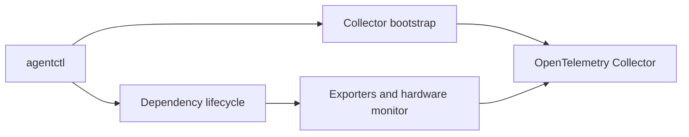

# Telemetry Agent

A small Go agent for bootstrapping an OpenTelemetry Collector and managing
host-level telemetry dependencies safely.

It currently manages:

- Windows Exporter for Windows host metrics
- Node Exporter for Linux host metrics
- Libre Hardware Monitor for Windows hardware metrics

## What It Does

`agentctl` provides two operational areas:

- **Bootstrap** — install and validate a pinned OpenTelemetry Collector with
  rendered configuration.
- **Dependency lifecycle** — list, install, reconcile, and inspect supported
  telemetry dependencies.

The dependency lifecycle reports availability, runtime health, and managed
configuration drift separately. This keeps a failed exporter visible even when
its configuration also needs repair.

## Quick Start

Requirements:

- Go 1.25.5 or later
- Administrator privileges for machine-wide Windows dependency installation
- Internet access when an installer needs to download a pinned artifact

```powershell
go run .\cmd\agentctl help

go run .\cmd\agentctl dependency list
go run .\cmd\agentctl dependency status

# Install one dependency.
go run .\cmd\agentctl dependency install windows-exporter

# Select one or more dependencies in a terminal.
go run .\cmd\agentctl dependency install
```

Use `agentctl bootstrap --help` for Collector bootstrap options.

## Architecture



The lifecycle layer uses a catalog of integrations. Each integration provides:

- A definition: name, description, and supported operating systems
- An installer: install or safely reconcile managed state
- An inspector: report lifecycle status without changing the host

Read the full design in
[managed dependency lifecycle](docs/architecture/managed-dependency-lifecycle.md).

## Repository Layout

```text
cmd/agentctl/          CLI entry point and command handlers
internal/bootstrap/    Collector artifact, configuration, and validation flow
internal/dependency/   Managed dependency catalog and integrations
internal/config/       Configuration rendering and atomic file writes
internal/identity/     Host platform discovery
internal/supervisor/   Collector process supervision
docs/                  Architecture, runbooks, requirements, and changelog
```

## Documentation

- [Product overview](docs/PRODUCT.md)
- [Architecture](docs/ARCHITECTURE.md)
- [Managed dependency lifecycle](docs/architecture/managed-dependency-lifecycle.md)
- [Dependency runbook](docs/runbooks/managed-dependencies.md)
- [Windows Exporter runbook](docs/runbooks/windows_exporter.md)
- [Node Exporter runbook](docs/runbooks/node-exporter.md)
- [Libre Hardware Monitor runbook](docs/runbooks/libre-hardware-monitor.md)
- [Requirements](docs/requirements/)
- [Changelog](docs/changelog/)

## Development

```powershell
go test .\...
go vet .\...
git diff --check
```

Keep tests deterministic and inject operating-system effects behind small
interfaces. Do not run real installers or mutate host services in unit tests.

## Releases

Release artifacts contain prebuilt `agentctl` binaries for Windows and Linux,
plus a `checksums.txt` file.

Verify downloaded artifacts before use:

```powershell
Get-FileHash .\telemetry-agent_<version>_windows_amd64.zip -Algorithm SHA256
```

## Current Scope

This project manages local telemetry dependencies and Collector bootstrap.

It does not yet provide remote fleet orchestration, a central Operations
Controller, or dependency uninstall/disable commands. See the documentation
and changelog for the current supported behavior.
