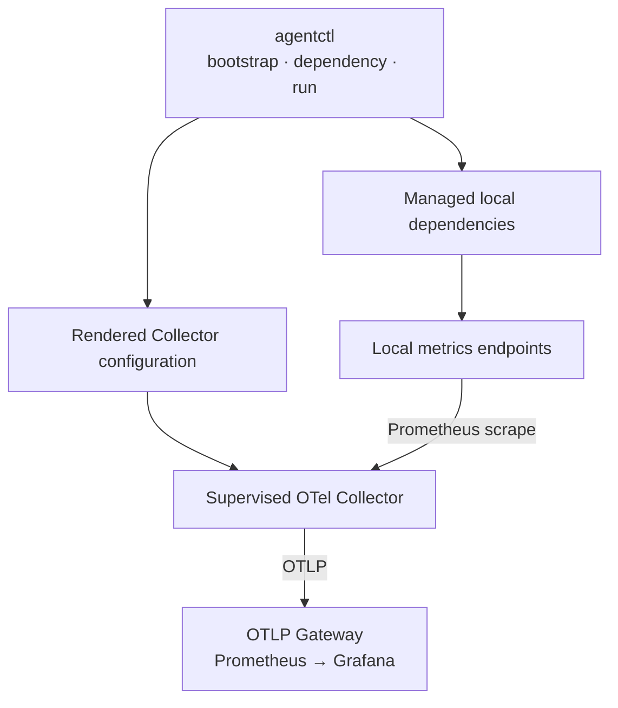
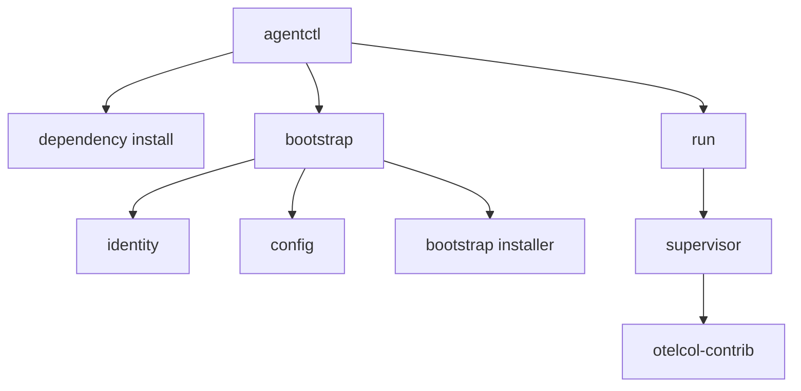
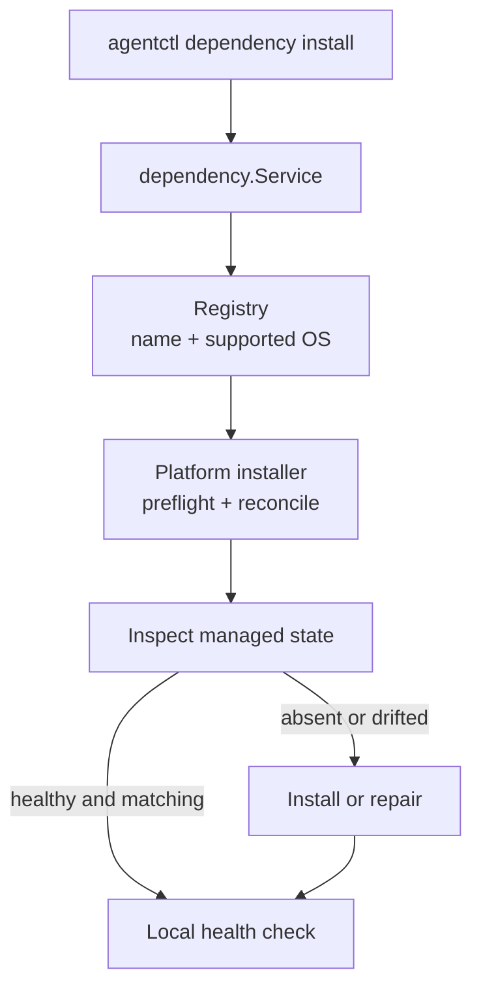
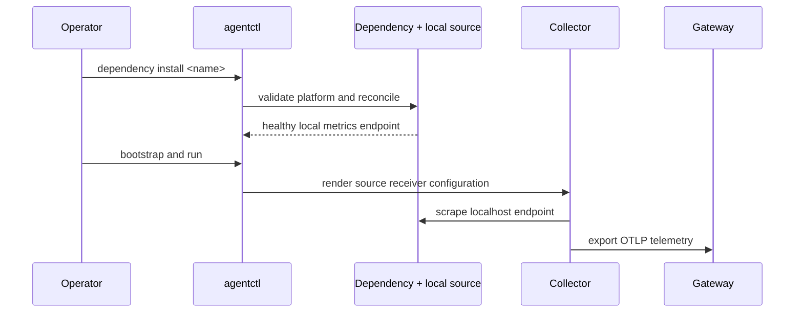
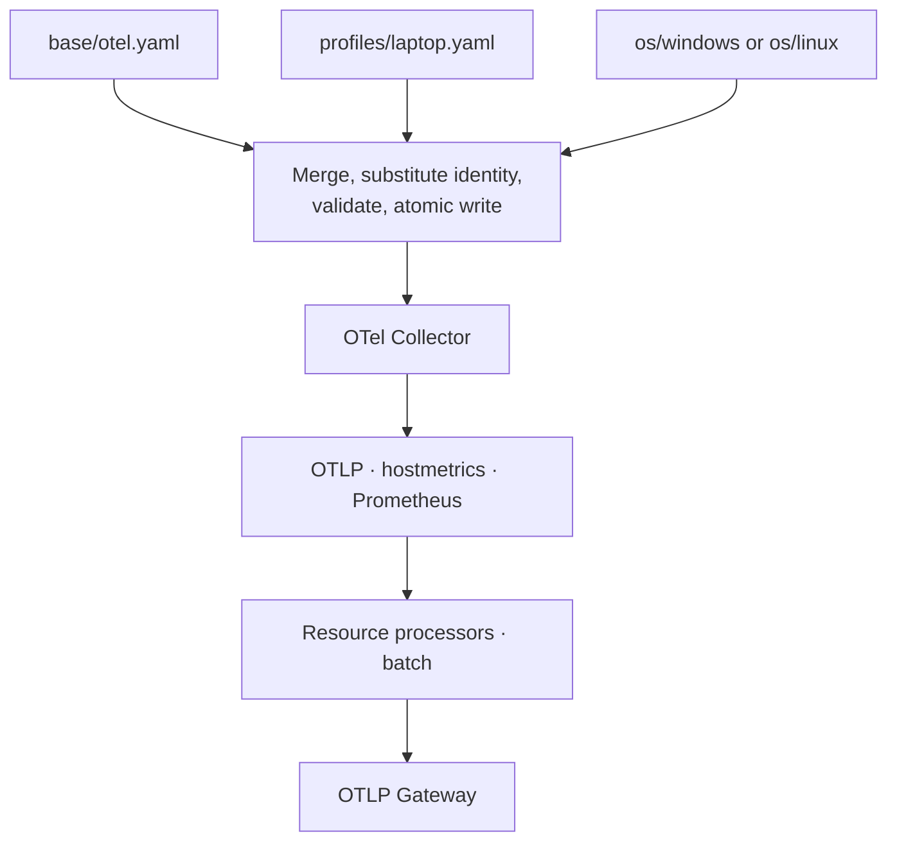

# AR-IMMS Telemetry Agent Architecture

> **Status**: implemented PoC architecture — Windows and Linux AMD64  
> **Scope**: up to three monitored nodes

## Purpose

The Telemetry Agent is a small Go control wrapper around a pinned
OpenTelemetry Collector. It manages local metric dependencies, renders a
deterministic Collector configuration, supervises the Collector process, and
exports telemetry to the AR-IMMS OTLP Gateway.

The Agent is not a monitoring backend and does not replace the Collector.

## Runtime topology



The local data path is always:

```text
Local source → OTel Collector → OTLP Gateway → Prometheus → Grafana
```

`agentctl` performs administrative work. The Collector owns telemetry
receivers, processors, batching, retry, and gateway export.

## Current boundaries

| Boundary              | Owns                                                                                  |
| --------------------- | ------------------------------------------------------------------------------------- |
| `cmd/agentctl`        | CLI parsing and production dependency wiring                                          |
| `internal/identity`   | Stable platform and host identity                                                     |
| `internal/config`     | Layer merge, rendering, validation, and atomic config writes                          |
| `internal/bootstrap`  | Pinned Collector download, checksum verification, installation, and config activation |
| `internal/dependency` | Dependency registry, platform validation, and installation dispatch                   |
| Dependency packages   | Platform-specific install, reconciliation, health, and managed-resource drift repair  |
| `internal/supervisor` | Collector child process, readiness, restart, and graceful shutdown                    |
| OTel Collector        | Scraping, telemetry processing, batching, retry, and OTLP export                      |
| Gateway stack         | OTLP ingestion, Prometheus storage, and Grafana visualization                         |

## Node control plane

`agentctl` is the single administrative entrypoint. It has three independent
flows: dependency management, Collector bootstrap, and foreground supervision.



## Managed metric sources

| Platform | Dependency             |   Local endpoint | Lifecycle owner              |
| -------- | ---------------------- | ---------------: | ---------------------------- |
| Windows  | Windows Exporter       | `127.0.0.1:9182` | Windows service              |
| Windows  | Libre Hardware Monitor | `127.0.0.1:9190` | `LocalSystem` scheduled task |
| Linux    | Node Exporter          | `127.0.0.1:9100` | systemd service              |
| Both     | Collector host metrics |       in-process | OTel Collector               |

All external exporters are scraped through Collector Prometheus receivers.
They never export directly to the gateway.

Libre Hardware Monitor can retain an upstream wildcard HTTP binding. Its
managed Windows Firewall rule blocks inbound TCP `9190`; only the local Agent
is intended to scrape it.

## Dependency architecture

The shared dependency package owns lookup and platform validation. Each
dependency package owns only its platform-specific resources.



| Dependency             | Managed resources                                                                               |
| ---------------------- | ----------------------------------------------------------------------------------------------- |
| Windows Exporter       | MSI installation, Agent-owned config, Windows service, `127.0.0.1:9182`                         |
| Node Exporter          | Verified binary, systemd unit, DynamicUser hardening, `127.0.0.1:9100`                          |
| Libre Hardware Monitor | Complete application directory, config XML, `LocalSystem` task, firewall rule, `127.0.0.1:9190` |

Note: The installer returns Reused=true only when the managed installation is already healthy and matches the Agent contract.

## Dependency lifecycle

Each dependency follows the same decision model:

```text
platform preflight
  → inspect managed state
  → absent: install and verify
  → healthy + matching: reuse
  → healthy + drifted: repair managed resources and verify
  → unhealthy: fail; never overwrite automatically
```

A dependency owns only its own files, service/task, configuration, and firewall
rule. It must not modify unrelated installations.

## Extending to N exporters

Adding another local exporter should not change the shared Collector pipeline.



A new exporter normally requires:

1. a `Definition` in `internal/dependency`;
2. a platform-specific installer/reconciler;
3. an Agent-owned local endpoint and health check;
4. an OS config fragment with a Prometheus receiver;
5. unit tests for installation, reuse, drift, failure, and rendered config.

Use custom Go telemetry collection only when neither an OTel receiver nor a
local exporter can provide the capability.

## Configuration model

The implemented layer order is:

```text
configs/base/otel.yaml
  → configs/profiles/laptop.yaml
  → configs/os/<windows|linux>/otel.yaml
  → rendered otel.yaml
```

Later layers override earlier scalar values; nested maps merge
deterministically. The rendered file contains host identity and is validated
before activation.

The current configuration provides:

- OTLP receive on `127.0.0.1:4317` and `127.0.0.1:4318`;
- Collector health endpoint on `127.0.0.1:13133`;
- local Prometheus scrapes for managed exporters;
- resource attributes for stable host identity;
- OTLP export to the configured gateway.

Vendor and machine-local override layers are future work; they are not part of
the current renderer contract.

## Configuration and telemetry runtime

Configuration is composed once during bootstrap. The running Collector consumes
only the rendered file and runtime gateway endpoint.



| OS layer | Managed local scrapes                                    |
| -------- | -------------------------------------------------------- |
| Windows  | Windows Exporter `:9182`, Libre Hardware Monitor `:9190` |
| Linux    | Node Exporter `:9100`                                    |

All receiver output uses the same metrics pipeline and gateway exporter.
Adding an exporter changes its dependency package and OS config fragment; it
does not create another delivery path.

## Operational commands

Start the local observability stack:

```bash
docker compose -f infra/observability/compose.yaml up -d
```

Run repository verification:

```bash
go test ./...
go vet ./...
```

### Windows

Run PowerShell as Administrator when installing dependencies:

```powershell
New-Item -ItemType Directory -Force ./tmp | Out-Null
go build -o ./tmp/agentctl.exe ./cmd/agentctl

$agentctl = './tmp/agentctl.exe'

& $agentctl dependency install windows-exporter
& $agentctl dependency install libre-hardware-monitor
```

Bootstrap and run the Collector:

```powershell
$collectorInstall = Join-Path $PWD 'tmp\collector-windows'
$configPath = Join-Path $PWD 'tmp\collector-windows-config\otel.yaml'

& $agentctl bootstrap `
  --config-root ./configs `
  --install-dir $collectorInstall `
  --config-path $configPath

$collectorPath = Join-Path `
  $collectorInstall `
  'versions\otelcol-contrib-0.160.0-windows-amd64\otelcol-contrib.exe'

& $agentctl run `
  --collector-path $collectorPath `
  --config-path $configPath `
  --gateway-endpoint 127.0.0.1:14317
```

### Linux

Build normally, then use root only for the systemd-managed dependency:

```bash
mkdir -p ./tmp
go build -o ./tmp/agentctl ./cmd/agentctl

agentctl=./tmp/agentctl

sudo "$agentctl" dependency install node-exporter
```

Bootstrap and run the Collector:

```bash
collector_install="$HOME/.local/share/telemetry-agent"
config_path="$HOME/.config/telemetry-agent/otel.yaml"

"$agentctl" bootstrap \
  --config-root ./configs \
  --install-dir "$collector_install" \
  --config-path "$config_path"

collector_path="$collector_install/versions/otelcol-contrib-0.160.0-linux-amd64/otelcol-contrib"

"$agentctl" run \
  --collector-path "$collector_path" \
  --config-path "$config_path" \
  --gateway-endpoint "<gateway-host>:14317"
```

`run` is foreground supervision; stop it with `Ctrl+C`.

## Verification

Check a local exporter before starting the Collector:

```text
Windows Exporter:          http://127.0.0.1:9182/metrics
Libre Hardware Monitor:    http://127.0.0.1:9190/metrics
Node Exporter:             http://127.0.0.1:9100/metrics
Collector health:          http://127.0.0.1:13133/
```

After one scrape interval, query Prometheus:

```promql
count by (exported_job) (
  {exported_job=~"windows_exporter|node_exporter|libre_hardware_monitor"}
)
```

A positive result confirms the local source → Collector → Gateway →
Prometheus path.

## Safety rules

- All artifacts are version- and SHA-256-pinned.
- Administrative dependencies require Administrator/root before changing
  machine-wide state.
- Existing unhealthy managed dependencies are not overwritten automatically.
- Exporter metrics remain local; external exposure requires an explicit design
  and security decision.
- The Agent does not reimplement Collector receivers, processors, retry queues,
  or OTLP delivery.
- Secrets and real gateway credentials stay outside committed configuration.

## Explicitly deferred

The following are not implemented yet:

- Agent registration, certificate issuance, and certificate rotation;
- Agent registration as a Windows Service or Linux systemd service;
- Collector auto-upgrades, dependency upgrades, and uninstall;
- bounded disk spool for custom Go adapters;
- Docker inventory/events collection and Windows Event Log collection;
- vendor-specific configuration layers;
- process-level telemetry capability policy;
- three-node automated end-to-end validation.

Changes to these boundaries, the managed-resource model, or security posture
require an ADR.
