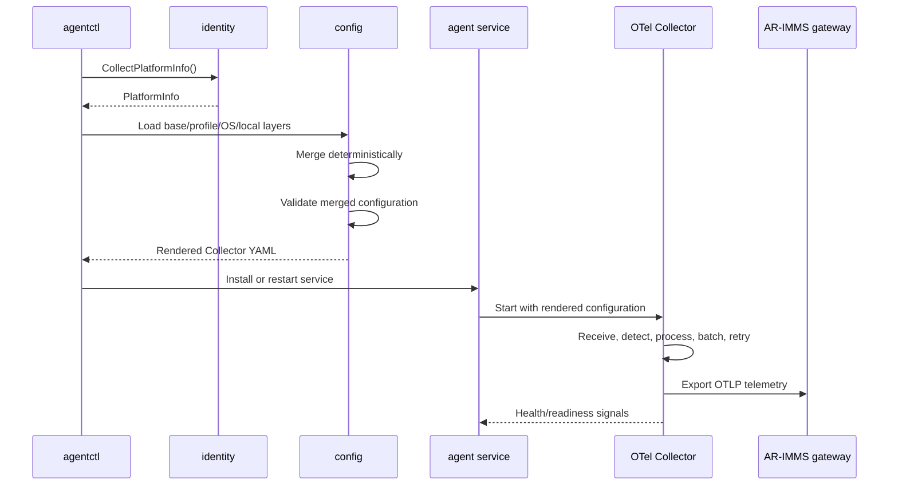

# AR-IMMS Telemetry Agent Architecture

> Status: Initial working design. This document is intentionally revisable as implementation and Collector capability checks add evidence.

## 1. Purpose and scope

The telemetry agent is a small, cross-platform node service for the AR-assisted Infrastructure Monitoring and Maintenance System (AR-IMMS). It runs on Windows and Linux nodes, discovers stable node identity, installs and supervises a pinned OpenTelemetry Collector, renders its configuration, and delivers telemetry to the AR-IMMS gateway.

The agent is a focused proof of concept for at most three laptops or nodes. It is not a replacement for the OpenTelemetry Collector or a general-purpose monitoring platform.

## 2. Core architectural decision

OpenTelemetry Collector is the telemetry data plane. The Go agent only implements lifecycle, identity, configuration, diagnostics, and capabilities that the Collector does not provide.

The Go agent must prefer the following order before custom collection code is introduced:

1. An OpenTelemetry Collector receiver, processor, connector, or exporter.
2. An existing local exporter consumed by the Collector.
3. A small platform or workload adapter with a stable interface.
4. Custom Go collection only when the previous options are insufficient.

The Go agent must not reimplement Collector receivers, processors, resource detection, batching, retry, persistent delivery buffering, or exporters when a supported Collector component can provide the capability.

## 3. Runtime topology

```mermaid
flowchart TD
    subgraph Node["Monitored node"]
        subgraph Agent["Go agent"]
            CLI["agentctl<br/>Install, configure, diagnose"]
            Runtime["agent service<br/>Composition and supervision"]
            Bootstrap["bootstrap<br/>Install and configure"]
            Identity["identity<br/>Platform and node identity"]
            Config["config<br/>Render and validate"]
            Adapters["custom adapters<br/>LHM, Docker inventory, service state"]
            Health["health<br/>Readiness and diagnostics"]
        end

        subgraph OTel["Pinned otelcol-contrib process"]
            Receivers["Receivers<br/>Host, Prometheus, Event Log, OTLP"]
            Pipeline["Processors<br/>Resources, filtering, batching"]
            Delivery["Exporter delivery<br/>Retry and persistent queue"]
        end

        Native["Native sources<br/>OS metrics, Windows exporter, logs"]
    end

    Control["Registration / Control API"]
    Gateway["AR-IMMS gateway<br/>OTLP ingestion boundary"]

    CLI --> Bootstrap
    Bootstrap --> Identity
    Bootstrap --> Config
    Identity --> Config
    Config --> Runtime

    Runtime --> OTel
    Native --> Receivers
    Adapters -->|OTLP localhost| Receivers
    Receivers --> Pipeline --> Delivery --> Gateway

    Runtime -->|enroll / renew| Control
    Control -->|certificate / policy| Runtime

    Health --> Runtime
    Health --> OTel
````

The Go agent and Collector are separate processes. They may be distributed in one installer, but each process remains independently restartable and observable.

`agentctl` is the administrative entrypoint. It installs dependencies, renders configuration, validates it, and manages administrative lifecycle commands.

The long-running agent service owns runtime supervision, custom adapters, runtime health, and communication with the registration/control plane.

Telemetry and control do not share the same endpoint:

```text
Telemetry:
Go adapters or local sources
  -> OTel Collector
  -> OTLP Gateway

Control:
Go agent
  -> Registration / Control API
```

## 4. Responsibility boundaries

| Area                                                            | Go agent                                                                  | OpenTelemetry Collector                          |
| --------------------------------------------------------------- | ------------------------------------------------------------------------- | ------------------------------------------------ |
| Platform and architecture detection                             | Owns                                                                      | Not applicable                                   |
| Physical host, compute node, vendor, and workload identity      | Owns                                                                      | Adds configured resource attributes              |
| Collector installation and configuration rendering              | Owns                                                                      | Consumes rendered configuration                  |
| Collector start, health checks, restart, upgrade, and uninstall | Owns                                                                      | Exposes process and health signals               |
| Host/workload/hardware collection                               | Owns adapters only where OTel is insufficient; sends output to local OTLP | Owns supported receivers/exporters               |
| Resource detection                                              | Provides identity unavailable to OTel                                     | Owns supported resource detectors                |
| Filtering, batching, retry, and persistent delivery queue       | Does not own                                                              | Owns                                             |
| OTLP/export protocol handling                                   | Only for custom adapter output to local Collector                         | Owns gateway delivery by default                 |
| Registration and certificate handling                           | Calls Registration API and stores returned identity material              | Consumes resulting secure endpoint/configuration |

## 5. Source ingestion model

Sources follow one of two paths.

### Standard OTel path

Use this path whenever the Collector has a supported receiver or can consume an existing local exporter:

```text
Windows exporter
  -> Prometheus receiver
  -> OTel pipeline

Windows Event Log
  -> Windows Event Log receiver
  -> OTel pipeline

Linux host metrics
  -> hostmetrics receiver
  -> OTel pipeline

Application OTLP
  -> OTLP receiver
  -> OTel pipeline
```

### Custom Go adapter path

Use this path only when OTel does not provide enough capability:

```text
LibreHardwareMonitor
  -> Go hardware adapter
  -> OTLP localhost
  -> OTel OTLP receiver
  -> OTel pipeline

Docker inventory/events/inspect
  -> Go Docker adapter
  -> OTLP localhost
  -> OTel OTLP receiver
  -> OTel pipeline

Windows service state
  -> Go service adapter
  -> OTLP localhost
  -> OTel OTLP receiver
  -> OTel pipeline
```

All telemetry reaches the gateway through the same local Collector pipeline.

The agent must avoid collecting duplicate canonical host metrics. For example, Windows exporter and `hostmetrics` must not both be enabled for the same CPU, memory, disk, and network metric set unless an ADR defines their distinct purpose and naming.

## 6. Package structure

```text
cmd/
  agent/             runtime process composition and startup only
  agentctl/          administrative lifecycle commands

internal/
  bootstrap/         dependency installation and first-run setup
  supervisor/        Collector process/service supervision
  config/            layered config loading, merging, rendering, validation
  identity/          platform, host, node, vendor, and workload identity
  platform/          Windows/Linux service and OS implementations
  adapters/          small integrations for capabilities unavailable in OTel
  otlp/              emits custom adapter output to the local Collector
  spool/             future bounded adapter-input buffering only
  health/            readiness, diagnostics, and lifecycle checks

configs/
  base/              platform-neutral Collector defaults
  profiles/          deployment profiles such as laptop
  os/windows/        Windows-specific Collector overrides
  os/linux/          Linux-specific Collector overrides
  vendors/           future vendor-specific overrides

packaging/           Windows service and Linux systemd assets
docs/                architecture, ADRs, runbooks, and plans
schemas/             configuration and telemetry contracts
tests/               integration and end-to-end tests
```

`main.go` composes dependencies and starts the process. It must not contain vendor checks, OS shell commands, transport details, or business logic.

`spool/` is intentionally deferred. It must not receive failed records from an OTel exporter. If introduced later, it buffers only custom adapter input before that input reaches the local OTLP receiver.

## 7. Identity model

Identity is hierarchical:

```text
physical_host_id -> compute_node_id -> workload_id -> container_id
```

* `physical_host_id` is the stable identity of the physical laptop or server.
* `compute_node_id` identifies this monitored agent installation/node.
* `workload_id` identifies a stable logical service, process, or workload where one can be established.
* `container_id` identifies an ephemeral runtime container.

Container IDs must not be the sole identity for historical workload data. Current inventory may use container IDs, but historical telemetry must preserve the logical workload distinction where possible.

The first identity contract is `PlatformInfo`, produced by `internal/identity` and consumed by configuration selection, diagnostics, and registration. It includes normalized OS/architecture data and optional platform metadata without exposing platform-specific types to shared consumers.

Go injects stable identity into the rendered Collector configuration, for example:

```text
asset.node.id
physical.host.id
device.manufacturer
device.model.identifier
```

The Collector resource detection then contributes runtime attributes such as:

```text
host.name
host.arch
os.type
os.description
```

The Collector applies both identity sets consistently to telemetry records.

## 8. Configuration flow

Configuration layers are merged in this order:

```text
base -> profile -> OS -> vendor -> local machine override
```

Later layers override earlier scalar values. Nested objects merge recursively using explicit rules. Lists use a documented deterministic policy; the initial implementation replaces a prior list rather than relying on implicit YAML concatenation.



Generated configuration must be reproducible from committed inputs plus explicitly supplied machine-local overrides. Secrets, private keys, tokens, and real machine endpoints stay outside version control.

## 9. Failure and recovery boundaries

* Invalid configuration prevents Collector startup and is reported with a contextual validation error.
* Collector crashes are observed by `supervisor`; restart behavior is bounded and observable.
* Gateway outages use the Collector retry queue and persistent storage first.
* A Go-owned spool, if introduced later, is bounded by explicit memory/disk limits and buffers only custom adapter input before that input reaches local OTLP.
* Missing hardware sensors, Docker permissions, service-manager failures, registration failures, and certificate errors are visible diagnostics; they are not silently downgraded to insecure behavior.
* Local receivers bind to localhost unless a network listener is explicitly required.

## 10. Delivery phases

### Phase 1: Bootstrap, configuration, lifecycle, and health

Implement platform identity, layered configuration, Collector installation/configuration, service lifecycle, health checks, and diagnostics.

The first working path is:

```text
agentctl
  -> detect platform
  -> render and validate Collector config
  -> install/start agent service
  -> supervise Collector
  -> verify local health
  -> export test OTLP to gateway
```

### Phase 2: Collection, adapter output, and OTLP delivery

Enable supported Collector receivers, add only necessary adapters, emit custom adapter data to local OTLP, and configure Collector-owned delivery buffering to the gateway.

### Phase 3: Registration, vendor expansion, simulation, and validation

Add secure registration and certificate handling, vendor-specific adapters/configuration, controlled simulation producers, and Windows/Linux plus three-node validation.

Alerting, incident creation, dashboards, topology persistence, AI/anomaly detection, and control-plane business logic remain outside the node agent.

## 11. Testing strategy

Testing is prioritized as follows:

1. Pure tests for identity, config merge, adapter mapping, and supervisor restart limits.
2. Fake platform and service-manager tests.
3. Source adapter tests using recorded or simulated input.
4. Collector configuration validation tests.
5. Windows/Linux integration tests.
6. Three-node end-to-end tests through the gateway.

Failure tests are first-class:

```text
gateway unavailable
registration denied
invalid or expired certificate
invalid configuration
missing sensors
Docker permission failure
Collector crash
reboot recovery
duplicate delivery
full adapter-input spool
```

## 12. Architectural guardrails

The following require an explicit ADR and demonstrated proof-of-concept need before introduction:

* dynamic remote code execution or arbitrary plugin loading;
* a custom query language;
* a distributed control plane inside the agent;
* a full package manager or auto-update service;
* AI or anomaly detection inside the node agent;
* replacement of the OpenTelemetry Collector;
* Datadog-style multi-process orchestration or framework abstraction.

This document is the initial baseline and should be updated when a change affects package boundaries, public APIs, telemetry/configuration schemas, deployment behavior, or the security model.
