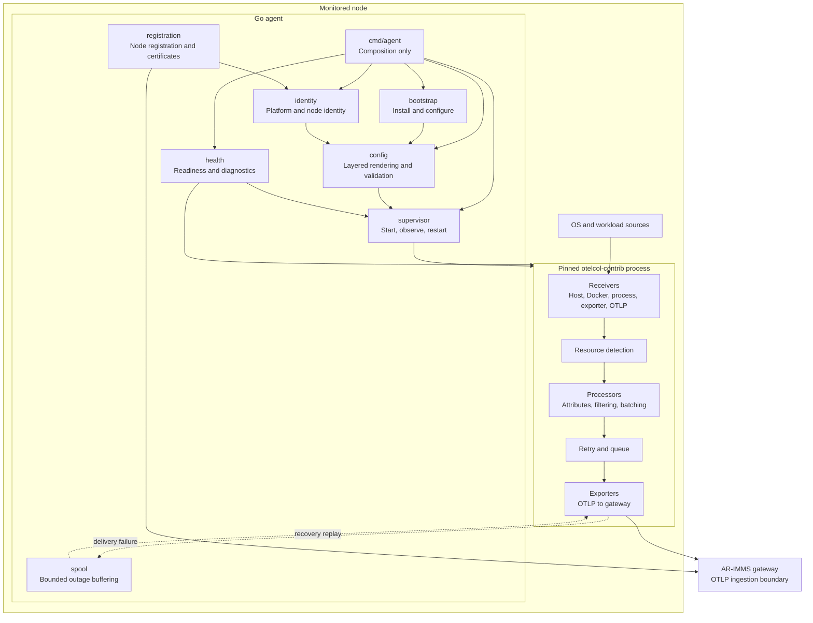
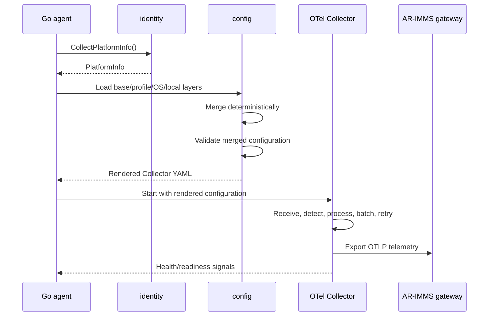

# AR-IMMS Telemetry Agent Architecture

> Status: Initial working design. This document is intentionally revisable as implementation and Collector capability checks add evidence.

## 1. Purpose and scope

The telemetry agent is a small, cross-platform node service for the AR-assisted Infrastructure Monitoring and Maintenance System (AR-IMMS). It runs on Windows and Linux nodes, discovers stable node identity, installs and supervises a pinned OpenTelemetry Collector, renders its configuration, and delivers telemetry to the AR-IMMS gateway.

The agent is a focused proof of concept for at most three laptops or nodes. It is not a replacement for the OpenTelemetry Collector or a general-purpose monitoring platform.

## 2. Core architectural decision

OpenTelemetry Collector is the telemetry pipeline. The Go agent only implements lifecycle, identity, configuration, diagnostics, and capabilities that the Collector does not provide.

The Go agent must prefer the following order before custom collection code is introduced:

1. An OpenTelemetry Collector receiver or processor.
2. An existing local exporter consumed by the Collector.
3. A small platform/workload adapter with a stable interface.
4. Custom Go collection only when the previous options are insufficient.

The Go agent must not reimplement Collector receivers, processors, resource detection, batching, retry, or exporters when a supported Collector component can provide the capability.

## 3. Runtime topology



The Go agent and Collector are separate processes. They may be distributed in one installer, but each process remains independently restartable and observable.

## 4. Responsibility boundaries

| Area | Go agent | OpenTelemetry Collector |
| --- | --- | --- |
| Platform and architecture detection | Owns | Not applicable |
| Physical host, compute node, vendor, and workload identity | Owns | Adds resource attributes when configured |
| Collector installation and configuration rendering | Owns | Consumes rendered configuration |
| Collector start, health checks, restart, upgrade, and uninstall | Owns | Exposes process/health signals |
| Host/workload/hardware collection | Only adapters where OTel is insufficient | Owns through supported receivers/exporters |
| Resource detection | Only identity unavailable to OTel | Owns supported resource detectors |
| Processing, normalization, filtering, batching, and retry | Does not own | Owns |
| OTLP/export protocol handling | Transport boundary only when required by the existing ingestion boundary | Owns by default |
| Bounded local outage buffering | Owns the agent-level spool | Owns in-process retry/queue where configured |
| Registration and certificate issuance | Owns | Consumes resulting secure endpoint/configuration |

## 5. Package structure

```text
cmd/
  agent/             process composition and startup only
  agentctl/          administrative lifecycle commands

internal/
  bootstrap/         dependency installation and first-run setup
  supervisor/        Collector process/service supervision
  config/            layered config loading, merging, rendering, validation
  identity/          platform, host, node, vendor, and workload identity
  platform/          Windows/Linux service and OS implementations
  sources/           small adapters for capabilities unavailable in OTel
  normalize/         canonical domain models for Go-owned data
  spool/             bounded memory/disk outage buffering
  transport/         authenticated delivery boundary when required
  health/            readiness, diagnostics, and lifecycle checks

configs/
  base/              platform-neutral Collector defaults
  profiles/          deployment profiles such as laptop
  os/windows/        Windows-specific Collector overrides
  os/linux/          Linux-specific Collector overrides
  vendors/           future vendor-specific overrides

packaging/           Windows service and Linux systemd assets
docs/                architecture, ADRs, runbooks, and plans
schemas/             configuration and telemetry contracts
tests/               integration and end-to-end tests
```

`main.go` composes dependencies and starts the process. It must not contain vendor checks, OS shell commands, transport details, or business logic.

## 6. Identity model

Identity is hierarchical:

```text
physical_host_id -> compute_node_id -> workload_id -> container_id
```

- `physical_host_id` is the stable identity of the physical laptop or server.
- `compute_node_id` identifies this monitored agent installation/node.
- `workload_id` identifies a stable logical service, process, or workload where one can be established.
- `container_id` identifies an ephemeral runtime container.

Container IDs must not be the sole identity for historical workload data. Current inventory may use container IDs, but historical telemetry must preserve the logical workload distinction where possible.

The first identity contract is `PlatformInfo`, produced by `internal/identity` and consumed by configuration selection, diagnostics, registration, and future normalization. It includes normalized OS/architecture data and optional platform metadata without exposing platform-specific types to shared consumers.

## 7. Configuration flow

Configuration layers are merged in this order:

```text
base -> profile -> OS -> vendor -> local machine override
```

Later layers override earlier scalar values. Nested objects merge recursively using explicit rules. Lists use a documented deterministic policy; the initial implementation replaces a prior list rather than relying on implicit YAML concatenation.

The flow is:



Generated configuration must be reproducible from committed inputs plus explicitly supplied machine-local overrides. Secrets, private keys, tokens, and real machine endpoints stay outside version control.

## 8. Failure and recovery boundaries

- Invalid configuration prevents Collector startup and is reported with a contextual validation error.
- Collector crashes are observed by `supervisor`; restart behavior is bounded and observable.
- Gateway outages use Collector retry/queue first. The Go-owned spool is bounded by explicit memory/disk limits and is used only for the agent-level outage boundary that Collector configuration cannot safely cover.
- Missing hardware sensors, Docker permissions, service-manager failures, and certificate errors are visible diagnostics; they are not silently downgraded to insecure behavior.
- Local receivers bind to localhost unless a network listener is explicitly required.

## 9. Delivery phases

### Phase 1: Bootstrap, configuration, lifecycle, and health

Implement platform identity, layered configuration, Collector installation/configuration, service lifecycle, health checks, and diagnostics.

### Phase 2: Collection, normalization, spool, and transport

Enable supported Collector receivers, add only necessary adapters, define canonical Go-owned models, implement bounded outage buffering, and connect authenticated delivery to the gateway.

### Phase 3: Registration, vendor expansion, simulation, and validation

Add secure registration and certificate handling, vendor-specific adapters/configuration, controlled simulation producers, and Windows/Linux plus three-node validation.

Alerting, incident creation, dashboards, topology persistence, AI/anomaly detection, and control-plane business logic remain outside the node agent.

## 10. Testing strategy

Testing is prioritized as follows:

1. Pure tests for identity, config merge, normalization, retry, and spool.
2. Fake platform and service-manager tests.
3. Source adapter tests using recorded or simulated input.
4. Collector configuration validation tests.
5. Windows/Linux integration tests.
6. Three-node end-to-end tests through the gateway.

Failure tests are first-class: gateway unavailable, invalid/expired certificates, invalid configuration, missing sensors, Docker permission failures, Collector crashes, reboot recovery, duplicate delivery, and a full local spool.

## 11. Architectural guardrails

The following require an explicit ADR and demonstrated proof-of-concept need before introduction:

- dynamic remote code execution or arbitrary plugin loading;
- a custom query language;
- a distributed control plane inside the agent;
- a full package manager or auto-update service;
- AI or anomaly detection inside the node agent;
- replacement of the OpenTelemetry Collector;
- Datadog-style multi-process orchestration or framework abstraction.

This document is the initial baseline and should be updated when a change affects package boundaries, public APIs, telemetry/configuration schemas, deployment behavior, or the security model.
