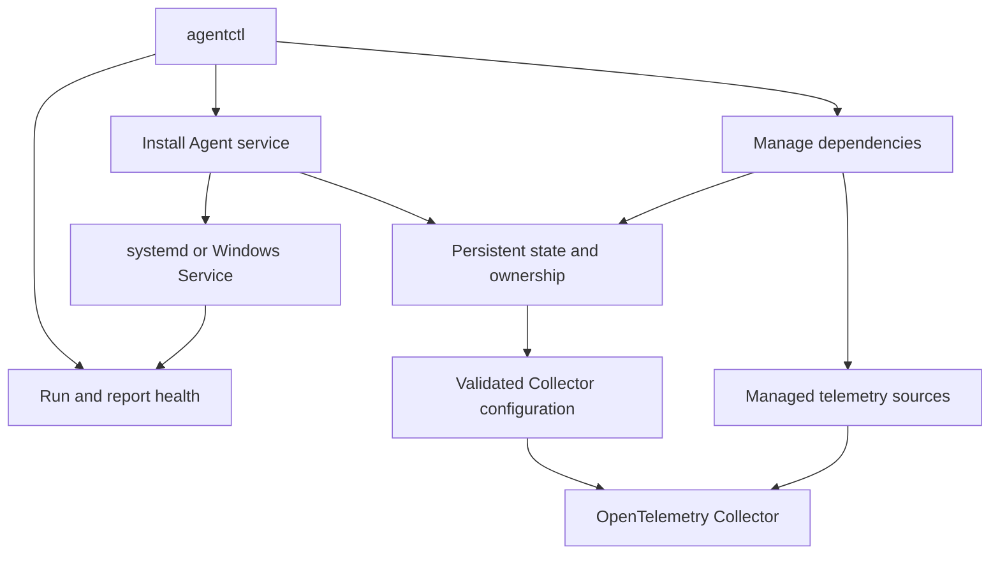

# Telemetry Agent

Telemetry Agent is a small Go application that runs an OpenTelemetry Collector
and safely manages host-level telemetry dependencies on one machine.

Supported managed dependencies:

- Windows Exporter for Windows host metrics
- Node Exporter for Linux host metrics
- Libre Hardware Monitor for Windows hardware metrics

## What It Does

`agentctl` manages three operational concerns:

- **Agent installation** — installs a durable Agent binary, bootstraps a pinned
  OpenTelemetry Collector, records ownership, and starts an OS service.
- **Collector runtime and health** — supervises the Collector, applies validated
  configuration changes, and exposes local Agent health through `agentctl status`.
- **Dependency lifecycle** — lists, installs, reconciles, configures, enables,
  disables, uninstalls, and inspects supported telemetry dependencies.

The Agent keeps desired state, activated Collector configuration, and confirmed
runtime state separate. This prevents host resources from being removed before
the Collector is healthy with a configuration that no longer references them.

## Quick Start

Requirements:

- Go 1.25.5 or later for development builds
- Internet access when a pinned Collector artifact must be downloaded
- `sudo` on Linux or an Administrator terminal on Windows for machine-wide
  installation and dependency operations

Build a local binary:

```bash
go build -o agentctl ./cmd/agentctl
./agentctl help
```

Install the Agent as a Linux systemd service. The configuration root is supplied
and owned by the operator:

```bash
sudo ./agentctl install \
  --config-root /etc/ar-imms/telemetry-agent/config
```

Verify that the service and Collector are healthy:

```bash
./agentctl status
sudo systemctl status ar-imms-telemetry-agent
```

Once the Agent is running, manage dependencies:

```bash
./agentctl dependency list
./agentctl dependency status
./agentctl dependency install node-exporter
./agentctl dependency configure
```

On Windows, run `agentctl.exe install` and dependency commands from an
Administrator PowerShell. See the installation runbook for platform-specific
commands and recovery steps.

## Safety and Ownership

- Collector configuration is rendered, validated, and atomically activated.
- The runtime restarts the Collector when its activated generation changes.
- Enable requires a recorded Agent-owned dependency installation.
- Disable and uninstall first remove the dependency receiver from Collector
  configuration.
- Host teardown runs only after the matching Collector generation is healthy.
- The Agent removes only resources recorded as Agent-owned during installation.
- The operator-provided Collector configuration root is never adopted or removed
  by the Agent.

Existing or manually installed dependencies are not automatically adopted for
physical removal.

## Architecture



Each dependency integration provides:

- A definition: name, description, and supported operating systems
- An installer: install or safely reconcile managed state
- An inspector: report lifecycle status without changing the host
- A teardown adapter: disable or uninstall recorded Agent-owned resources

## Repository Layout

```text
cmd/agentctl/          CLI entry point and command handlers
internal/agenthealth/  Local Agent health model, server, and client
internal/agentinstallation/
                       OS service installation and Agent-owned layout
internal/agentstate/   Persistent lifecycle state and ownership records
internal/agentlifecycle/
                       Configuration activation and Collector runtime watcher
internal/bootstrap/    Collector artifact, configuration, and validation flow
internal/dependency/   Managed dependency catalog and integrations
internal/config/       Configuration rendering and atomic file writes
internal/identity/     Host platform discovery
internal/supervisor/   Collector process supervision
docs/                  Architecture, runbooks, requirements, and changelog
```

## Documentation

- [Product overview](docs/PRODUCT.md)
- [Architecture](docs/ARCHITECTURE.md)
- [Agent installation runbook](docs/runbooks/agent-installation.md)
- [Managed dependencies runbook](docs/runbooks/managed-dependencies.md)
- [Desired-state configuration lifecycle](docs/architecture/desired-state-configuration-lifecycle.md)
- [Managed dependency lifecycle](docs/architecture/managed-dependency-lifecycle.md)
- [Windows Exporter runbook](docs/runbooks/windows_exporter.md)
- [Node Exporter runbook](docs/runbooks/node-exporter.md)
- [Libre Hardware Monitor runbook](docs/runbooks/libre-hardware-monitor.md)
- [Requirements](docs/requirements/)
- [Changelog](docs/changelog/)

## Development

```bash
go test ./... -count=1
go vet ./...
go build ./...
git diff --check
```

Keep tests deterministic and inject operating-system effects behind small
interfaces. Unit tests must not run real installers or mutate host services.

## Current Scope

This project manages local Collector bootstrap, runtime health, and telemetry
dependencies on one machine.

It does not provide remote fleet orchestration, a central Operations Controller,
automatic ownership adoption, or whole-Agent clean uninstall yet.
