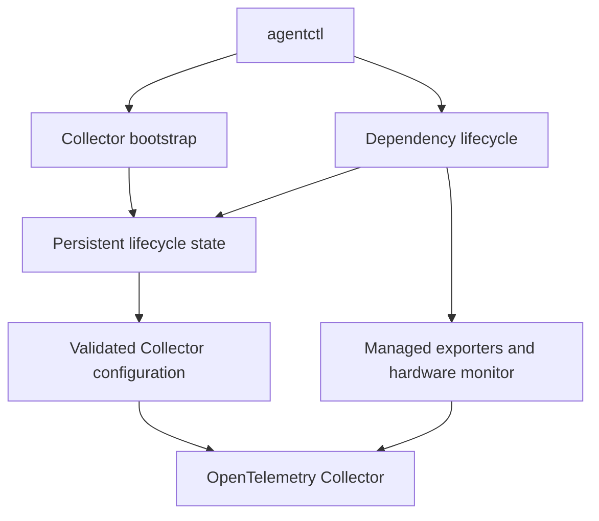

## Foundation Checks

```bash
go test ./... -count=1
go vet ./...
go build ./...
git diff --check
```

Thay toàn bộ `README.md` root bằng:

# Telemetry Agent

A small Go agent for bootstrapping an OpenTelemetry Collector and managing
host-level telemetry dependencies safely.

It currently manages:

- Windows Exporter for Windows host metrics
- Node Exporter for Linux host metrics
- Libre Hardware Monitor for Windows hardware metrics

## What It Does

`agentctl` provides two operational areas:

- **Bootstrap** — installs and validates a pinned OpenTelemetry Collector with
  rendered configuration.
- **Dependency lifecycle** — lists, installs, reconciles, configures,
  enables, disables, uninstalls, and inspects supported telemetry dependencies.

The lifecycle keeps requested state, active Collector configuration, and
confirmed runtime state separate. Physical cleanup happens only after the
Collector is ready with a configuration that no longer references the
dependency.

## Quick Start

Requirements:

- Go 1.25.5 or later
- Administrator privileges for machine-wide Windows dependency operations
- Internet access when an installer needs to download a pinned artifact

```powershell
go run .\cmd\agentctl help

go run .\cmd\agentctl dependency list
go run .\cmd\agentctl dependency status

# Install one dependency.
go run .\cmd\agentctl dependency install windows-exporter

# Start the managed Collector runtime after bootstrap.
go run .\cmd\agentctl run

# In a second Administrator terminal, configure managed dependencies.
go run .\cmd\agentctl dependency configure
go run .\cmd\agentctl dependency pending
```

Use `agentctl bootstrap --help` for Collector bootstrap options and
`agentctl dependency help` for dependency lifecycle commands.

## Lifecycle Safety

- Collector configuration is rendered, validated, and atomically activated.
- The runtime restarts the Collector when the activated generation changes.
- Enable is allowed only for dependencies with recorded Agent-owned resources
- Disable and uninstall first remove the dependency receiver from Collector
  configuration.
- Host teardown runs only after the matching Collector generation is healthy.
- The Agent removes only resources recorded as Agent-owned during a fresh
  installation.

Existing or manually installed dependencies are not automatically adopted for
physical removal.

## Architecture



The lifecycle layer uses a catalog of integrations. Each integration provides:

- A definition: name, description, and supported operating systems
- An installer: install or safely reconcile managed state
- An inspector: report host lifecycle status without changing the machine
- A teardown adapter: disable or uninstall recorded Agent-owned resources

Read the detailed lifecycle design in
[desired-state configuration lifecycle](docs/architecture/desired-state-configuration-lifecycle.md).

## Repository Layout

```text
cmd/agentctl/          CLI entry point and command handlers
internal/agentstate/   Persistent lifecycle state and ownership records
internal/agentlifecycle/
                       Configuration activation and Collector runtime watcher
internal/bootstrap/    Collector artifact, configuration, and validation flow
internal/dependency/   Managed dependency catalog and integrations
internal/config/       Configuration rendering and atomic file writes
internal/identity/     Host platform discovery
internal/supervisor/   Collector process supervision
docs/                  Architecture, runbooks, requirements, and changelog
```

## Documentation

- [Product overview](docs/PRODUCT.md)
- [Architecture](docs/ARCHITECTURE.md)
- [Desired-state configuration lifecycle](docs/architecture/desired-state-configuration-lifecycle.md)
- [Dependency runbook](docs/runbooks/managed-dependencies.md)
- [Windows Exporter runbook](docs/runbooks/windows_exporter.md)
- [Node Exporter runbook](docs/runbooks/node-exporter.md)
- [Libre Hardware Monitor runbook](docs/runbooks/libre-hardware-monitor.md)
- [Managed dependency lifecycle](docs/architecture/managed-dependency-lifecycle.md)
- [Requirements](docs/requirements/)
- [Changelog](docs/changelog/)

## Development

```powershell
go test ./... -count=1
go vet ./...
git diff --check
```

Keep tests deterministic and inject operating-system effects behind small
interfaces. Do not run real installers or mutate host services in unit tests.

## Releases

Release artifacts contain prebuilt `agentctl` binaries for Windows and Linux,
plus a `checksums.txt` file.

Verify downloaded artifacts before use:

```powershell
Get-FileHash .\telemetry-agent_<version>_windows_amd64.zip -Algorithm SHA256
```

## Current Scope

This project manages local telemetry dependencies and Collector bootstrap on
one machine.

It does not provide remote fleet orchestration, a central Operations
Controller, or automatic ownership adoption for dependencies installed outside
the Agent.
