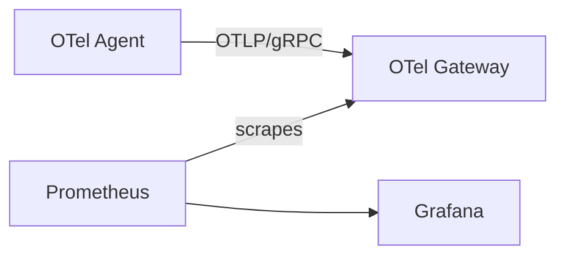

# ADR-0001: Use an OTel Gateway with Prometheus Scrape

- **Status:** Accepted
- **Date:** 2026-09-16
- **Decision owner:** Not recorded
- **Related task / plan:** Not recorded
- **Supersedes:** N/A
- **Superseded by:** N/A

## Context

The telemetry agent must collect metrics from Windows and Linux nodes while
keeping agent configuration independent from the final observability backends.
The architecture must later support additional observability and analytics
destinations without changing every node agent.

## Decision Drivers

- Keep Agent configuration independent from the final observability backends.
- Support additional observability and analytics destinations without changing
  every node agent.

## Considered Options

Options were not recorded in the original ADR.

## Decision

We will use an OTel Gateway with Prometheus scrape for this metrics data path:

The Agent exports metrics to one Gateway endpoint. The Gateway exposes a
Prometheus-format endpoint, and Prometheus pulls from that endpoint.

For the homelab proof of concept, Agent-to-Gateway OTLP/gRPC is plaintext.
The Agent explicitly configures `tls.insecure: true`.

The Gateway Prometheus exporter enables resource-to-telemetry conversion so
Agent resource attributes are available as Prometheus labels.

## Consequences

### Positive

- Agent configuration does not depend on Prometheus or Grafana.
- The Gateway is the single fan-out and policy boundary.
- Prometheus retains its normal pull model.
- Future analytics or business paths can be added at the Gateway.
- Stable `host.id` is queryable across all host metrics.

### Negative / Trade-offs

- Plaintext OTLP is acceptable only in the temporary trusted homelab network.
- A local all-in-one development setup must use a different host port for
  Gateway ingress (`14317`) because the Agent owns local port `4317`.
- This phase has no durable queue, high availability, or end-to-end encryption.

### Risks

- Plaintext OTLP is acceptable only in the temporary trusted homelab network;
  replace it with registered mTLS in the registration and certificate-management
  phase.

## Implementation Constraints

- The Agent explicitly configures `tls.insecure: true` for the homelab proof
  of concept.
- The Gateway Prometheus exporter enables resource-to-telemetry conversion so
  Agent resource attributes are available as Prometheus labels.
- A local all-in-one development setup uses Gateway ingress port `14317`
  because the Agent owns local port `4317`.

## Validation

- No validation evidence was recorded in the original ADR.

## Follow-up

- Replace plaintext transport with registered mTLS in the registration and
  certificate-management phase.
- Add backend fan-out only after the metrics baseline is stable.
