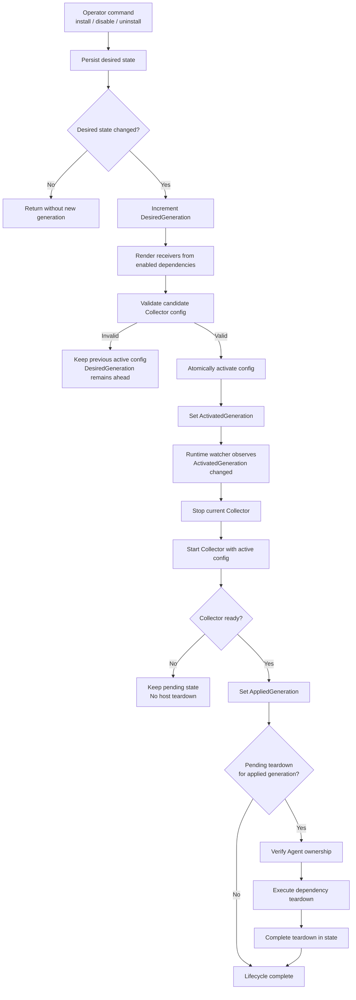
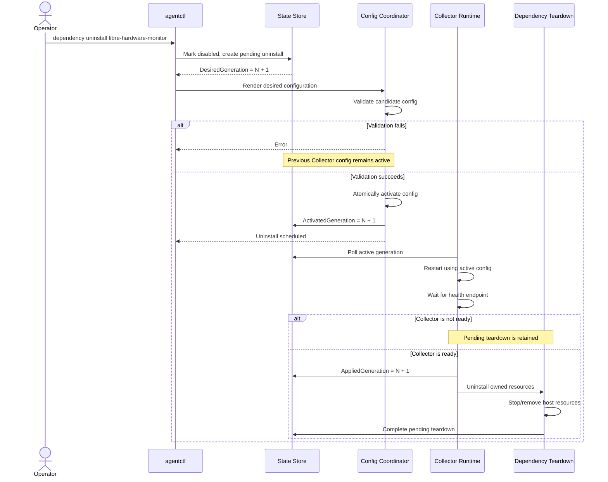

# Desired State and Collector Configuration Lifecycle

## Purpose

This lifecycle lets the Agent change managed telemetry dependencies without
leaving the OpenTelemetry Collector with a stale configuration or removing a
resource that the Collector may still scrape.

It separates requested state, active configuration, and confirmed runtime
state.

## Generation Model

| Field                 | Meaning                                                                                                   |
| --------------------- | --------------------------------------------------------------------------------------------------------- |
| `DesiredGeneration`   | Latest dependency state requested by the operator.                                                        |
| `ActivatedGeneration` | A valid Collector configuration for that desired state was rendered, validated, and atomically activated. |
| `AppliedGeneration`   | The Collector reported ready while running the activated configuration.                                   |

A dependency receiver is rendered only when that dependency is enabled in
desired state.

## Lifecycle Overview

## Disable and Uninstall Sequence

## Operations

| Command                       | Result                                                                                                                                               |
| ----------------------------- | ---------------------------------------------------------------------------------------------------------------------------------------------------- |
| `dependency install <name>`   | Installs or reconciles a supported dependency, records fresh-install ownership, enables its receiver, and activates the new Collector configuration. |
| `dependency disable <name>`   | Removes the receiver from desired configuration and schedules a non-destructive teardown after Collector readiness.                                  |
| `dependency uninstall <name>` | Removes the receiver from desired configuration and schedules physical cleanup after Collector readiness.                                            |
| `dependency pending`          | Lists teardown operations waiting for the matching Collector generation.                                                                             |
| `dependency status`           | Combines host inspection with persisted lifecycle state. Dependencies absent from both are shown as `not installed`.                                 |

## Safety Rules

- A candidate configuration is validated before it replaces the active one.
- `ActivatedGeneration` changes only after atomic configuration activation.
- The runtime watcher reacts to `ActivatedGeneration`, not directly to
  `DesiredGeneration`.
- Disable and uninstall remove the Collector receiver before host teardown.
- Teardown runs only after `AppliedGeneration` reaches the pending generation.
- Physical cleanup requires recorded Agent ownership. Existing or
  third-party resources are not automatically claimed or removed.
- A failed teardown remains pending instead of being marked complete.

## Failure and Recovery

If configuration validation fails, the previous valid Collector configuration
continues running. The requested generation remains ahead of the activated
generation, making the incomplete operation visible in persisted state.

If the Collector does not become ready, host resources are preserved. A later
runtime restart can apply the activated generation and continue the pending
teardown safely.

## Strengths

- Prevents the Collector from scraping a dependency after it is removed.
- Keeps desired state and actual runtime progress observable.
- Uses atomic configuration replacement.
- Limits destructive actions to resources the Agent recorded as its own.
- Supports safe recovery after interrupted operations.

## Current Limitations

- Teardowns run on the local machine only; there is no remote fleet control.
- A dependency installed before ownership tracking is not automatically
  adopted for physical removal.
- Node Exporter end-to-end validation requires a Linux host.
