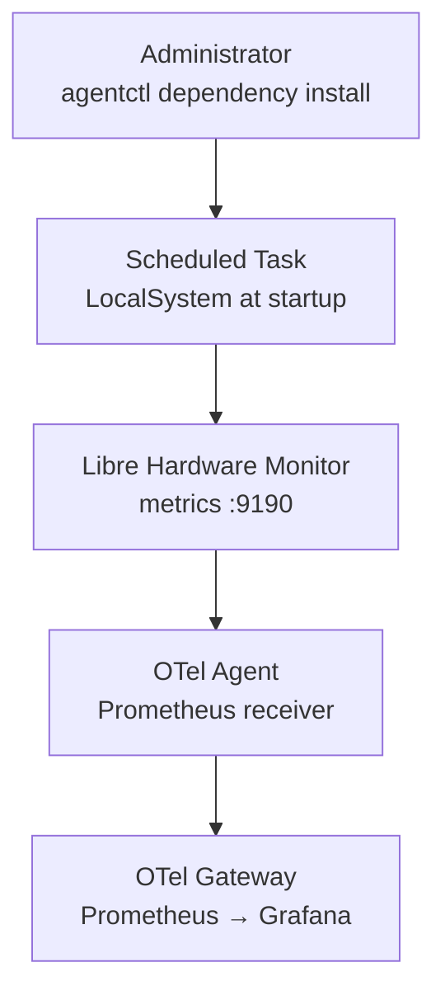

# Managed Libre Hardware Monitor dependency

Libre Hardware Monitor (LHM) supplies hardware sensors that Windows Exporter
does not expose consistently, such as temperatures, fan speeds, voltages, and
GPU sensor values.



## Managed resources

| Resource        | Agent-owned value                                   | Purpose                                              |
| --------------- | --------------------------------------------------- | ---------------------------------------------------- |
| Release         | LHM `v0.9.6`, SHA-256 pinned ZIP                    | Reproducible, verified installation                  |
| Installation    | `C:\Program Files\AR-IMMS\LibreHardwareMonitor`     | Contains the complete upstream application directory |
| Configuration   | `LibreHardwareMonitor.config` beside the executable | Enables web metrics on TCP `9190`                    |
| Startup         | `AR-IMMS-LibreHardwareMonitor` scheduled task       | Runs LHM as `LocalSystem` at boot                    |
| Network control | Inbound Windows Firewall block on TCP `9190`        | Prevents remote access to the metrics endpoint       |
| Scraper         | `prometheus/libre_hardware_monitor`                 | The local OTel Agent scrapes `127.0.0.1:9190`        |

## Network boundary

LHM's upstream HTTP listener can persist a wildcard binding instead of a
loopback-only binding. The Agent therefore treats the firewall as the security
boundary:

```text
Remote network ──X── TCP 9190 firewall block ──> LHM
Local OTel Agent ────── 127.0.0.1:9190 ───────> LHM
```

The gateway endpoint is independent of this block. For example, Agent egress
to the local gateway on TCP `14317` remains allowed.

## Lifecycle and reconciliation

| Observed state                                          | Agent behavior                                                                                              |
| ------------------------------------------------------- | ----------------------------------------------------------------------------------------------------------- |
| Scheduled task absent                                   | Download, verify, install, write config, configure firewall, register and run task, then verify `/metrics`. |
| Healthy and all managed resources match                 | Reuse without changes.                                                                                      |
| Healthy but config, firewall, or task definition drifts | Repair managed resources and verify `/metrics`; do not download the archive again.                          |
| Existing task unhealthy                                 | Stop with an error; never overwrite it automatically.                                                       |

The installer requires an Administrator terminal before it inspects or changes
machine-wide state.

## Out of scope

Archive upgrades, uninstall, sensor selection policy, TLS/authentication for
the upstream LHM endpoint, and process-level telemetry are not part of this
dependency.
