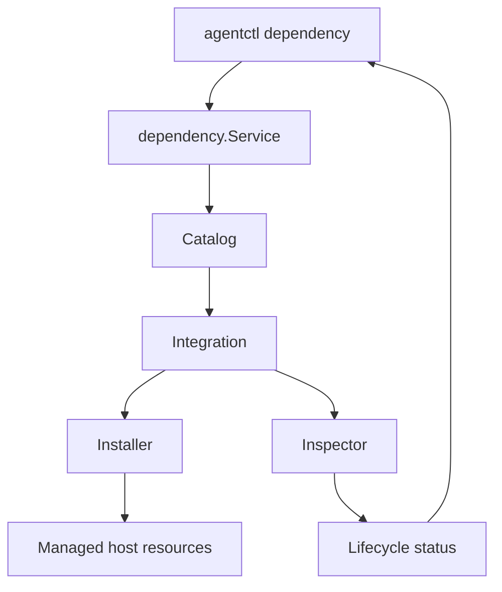

# Managed Dependency Lifecycle Architecture

## Purpose

The dependency lifecycle layer gives `agentctl` one consistent way to discover,
install, reconcile, and inspect platform telemetry integrations.

## Core Model

`Catalog` is the source of truth for built-in integrations.

Each `Integration` contains:

- `Definition`: stable name, display name, description, supported operating
  systems
- `Install`: installs or reconciles the dependency
- `Inspect`: reads its current lifecycle state

A catalog rejects an integration that has no installer or inspector.

## Separation of Responsibilities

| Component | Responsibility                                          |
| --------- | ------------------------------------------------------- |
| CLI       | Parse commands, render output, run terminal selection   |
| Catalog   | Find and list supported integrations                    |
| Service   | Enforce platform checks and invoke integrations         |
| Installer | Apply safe, integration-specific reconciliation         |
| Inspector | Read service/task/config/runtime state without mutation |

## Status Semantics

Health and drift are separate signals.

- **Healthy, not drifted:** managed runtime is working and configuration matches.
- **Healthy, drifted:** runtime works, but Agent-owned configuration differs.
- **Unhealthy, drifted:** runtime has failed and configuration also differs.
- **Disabled:** the managed service or task does not exist or is disabled.
- **Unknown:** inspection could not complete.

This prevents a drift label from hiding an operational failure.

## Reconciliation Policy

Installers are idempotent where ownership is known.

1. Inspect the current state.
2. Reuse a healthy matching installation.
3. Repair known Agent-owned drift when the integration defines a safe repair.
4. Refuse to overwrite an unhealthy or unknown third-party state.

The policy prioritizes preserving an operator's existing installation over
forcing a replacement.
