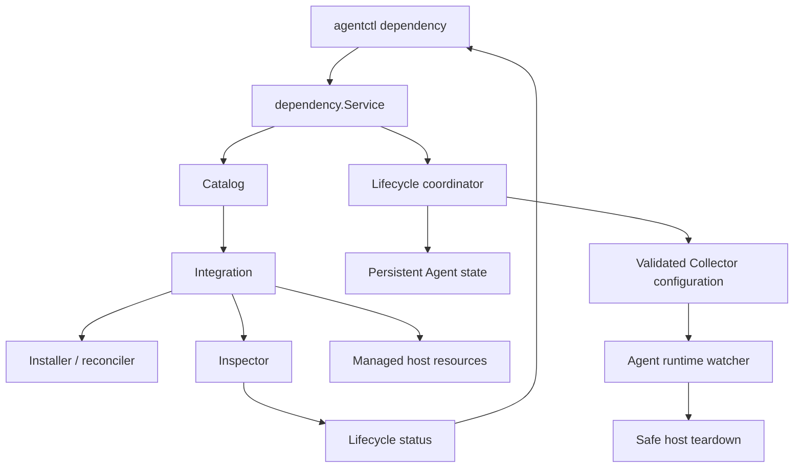
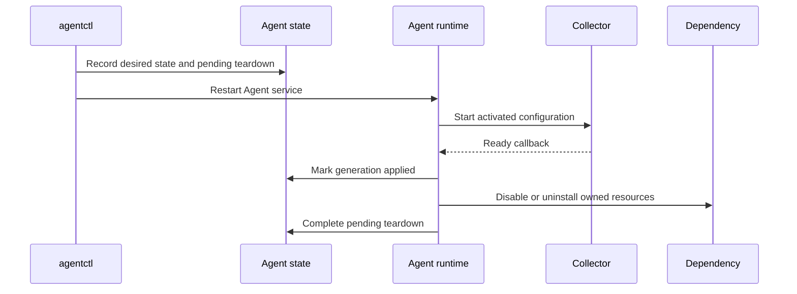

# Managed Dependency Lifecycle Architecture

## Purpose

The dependency lifecycle layer gives `agentctl` one consistent way to discover,
install, reconcile, configure, inspect, disable, and uninstall platform
telemetry integrations.



## Core model

`Catalog` is the source of truth for built-in integrations.

Each `Integration` contains:

- `Definition`: stable name, display name, description, and supported platforms.
- `Install`: installs or safely reconciles the dependency.
- `Inspect`: reads current lifecycle state without mutation.

Lifecycle-capable integrations may also provide platform-specific enable and
teardown adapters. They operate only on resources recorded as Agent-owned.

A catalog rejects an integration without an installer or inspector.

## Separation of responsibilities

| Component              | Responsibility                                                         |
| ---------------------- | ---------------------------------------------------------------------- |
| CLI                    | Parse commands, render output, and run terminal selection.             |
| Catalog                | Find and list supported integrations.                                  |
| Service                | Enforce platform checks and invoke integrations.                       |
| Lifecycle coordinator  | Persist desired dependency state and activate Collector configuration. |
| Installer / reconciler | Safely install, reuse, repair, or refuse an integration.               |
| Inspector              | Read service, task, configuration, or runtime state.                   |
| Runtime watcher        | Acknowledge a ready Collector generation and apply safe teardowns.     |
| Teardown adapter       | Disable or uninstall recorded Agent-owned host resources.              |

## Generation model

Dependency changes are represented by durable Collector generations.

| Field                 | Meaning                                                       |
| --------------------- | ------------------------------------------------------------- |
| `desiredGeneration`   | The requested dependency state is persisted.                  |
| `activatedGeneration` | A rendered and validated Collector configuration is selected. |
| `appliedGeneration`   | The Collector reported ready for that activated generation.   |

A completed lifecycle action satisfies:

```text
desiredGeneration = activatedGeneration = appliedGeneration
```

The Agent status endpoint exposes this invariant at
`GET /v1/status`.

## Managed state transitions

An installed Agent must first have Collector context. Dependency management is
rejected until Collector bootstrap has completed.

`dependency install` installs or reconciles one dependency. A fresh Agent-owned
installation records the host resources it created.

`dependency configure` presents dependencies recorded in Agent state:

- `●` means enabled.
- `○` means disabled.
- `Space` toggles desired state.
- `Enter` applies changed entries only.
- `q`, `Esc`, and `Ctrl+C` cancel without side effects.

Enable is allowed only when the disabled dependency still has recorded
Agent-owned resources. The platform adapter restores the dependency and the
Collector generation enables its receiver.

Disable and uninstall are two-stage operations:



The physical dependency is changed only after the replacement Collector is
ready without that dependency receiver.

- **Disable** preserves the dependency record and ownership so it can be
  enabled again.
- **Uninstall** removes the dependency record after physical teardown
  completes.

## Ownership and reconciliation

Installers are idempotent only where ownership is known.

1. Inspect current state.
2. Reuse a healthy matching installation.
3. Repair known Agent-owned drift when the integration defines a safe repair.
4. Refuse to overwrite unhealthy or unknown third-party state.

The Agent removes only resources recorded in its state. This protects manually
installed software and legacy resources that were not recorded by the current
Agent state.

Examples of Agent-owned resources:

- Windows Exporter MSI product, service, configuration, and installation
  directory.
- Libre Hardware Monitor scheduled task, process, firewall rule,
  configuration, and installation directory.
- Linux Node Exporter systemd service, binary, and installation directory.

## Windows runtime behavior

The Agent service owns the Collector child process. When a newer generation is
activated, the runtime stops the old Collector before launching the replacement.

A Windows service has no console, so a graceful console control signal can
fail. The supervisor then force-terminates and reaps the Collector child. A
non-zero exit caused by that deliberate force-kill is treated as a successful
transition, not as a failed Collector generation.

## Status semantics

Health and drift are separate signals.

- **Healthy, not drifted:** managed runtime works and configuration matches.
- **Healthy, drifted:** runtime works but Agent-owned configuration differs.
- **Unhealthy, drifted:** runtime failed and configuration differs.
- **Disabled:** managed service or task is disabled or absent.
- **Unknown:** inspection could not complete.

This prevents a drift label from hiding an operational failure.
