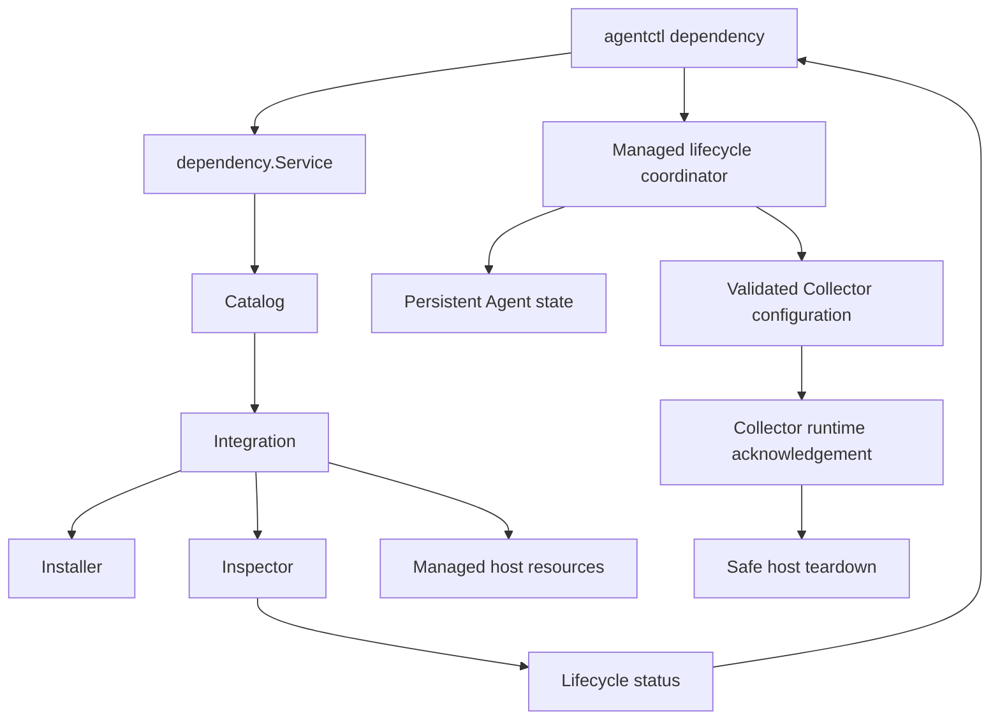

# Managed Dependency Lifecycle Architecture

## Purpose

The dependency lifecycle layer gives `agentctl` one consistent way to discover,
install, reconcile, configure, and inspect platform telemetry integrations.

## Core Model

`Catalog` is the source of truth for built-in integrations.

Each `Integration` contains:

- `Definition`: stable name, display name, description, and supported operating
  systems
- `Install`: installs or reconciles the dependency
- `Inspect`: reads its current lifecycle state

Lifecycle-capable integrations may also provide platform-specific enable and
teardown adapters. These adapters operate only on resources recorded as
Agent-owned.

A catalog rejects an integration that has no installer or inspector.

## Separation of Responsibilities

| Component             | Responsibility                                                       |
| --------------------- | -------------------------------------------------------------------- |
| CLI                   | Parse commands, render output, and run terminal selection            |
| Catalog               | Find and list supported integrations                                 |
| Service               | Enforce platform checks and invoke integrations                      |
| Lifecycle coordinator | Change desired dependency state and activate Collector configuration |
| Installer             | Apply safe, integration-specific reconciliation                      |
| Inspector             | Read service, task, config, or runtime state without mutation        |
| Runtime watcher       | Acknowledge a healthy Collector generation and apply safe teardowns  |
| Teardown adapter      | Disable or uninstall recorded Agent-owned host resources             |

## Managed State Transitions

A dependency is first installed or reconciled through `dependency install`. A
fresh installation records the host resources that the Agent created.

`dependency configure` presents every dependency recorded in Agent state:

- `●` means enabled.
- `○` means disabled.
- `Space` toggles the desired state.
- `Enter` applies only changed entries.
- `q`, `Esc`, and `Ctrl+C` cancel without side effects.

Enabling is allowed only when the disabled dependency still has recorded
Agent-owned resources. The platform adapter restores those resources and the
Collector configuration is activated with the dependency receiver enabled.

Disable and uninstall are two-stage operations:

1. The lifecycle coordinator records the desired state, renders and validates a
   Collector configuration without the dependency receiver, then activates the
   new generation.
2. The runtime watcher marks that generation applied only after the Collector is
   ready. It then executes the pending physical teardown.

Disable preserves the dependency record and ownership so it can be enabled
again. Uninstall removes the dependency record after physical teardown
completes.

## Status Semantics

Health and drift are separate signals.

- **Healthy, not drifted:** managed runtime is working and configuration matches.
- **Healthy, drifted:** runtime works, but Agent-owned configuration differs.
- **Unhealthy, drifted:** runtime has failed and configuration also differs.
- **Disabled:** the managed service or task does not exist or is disabled.
- **Unknown:** inspection could not complete.

This prevents a drift label from hiding an operational failure.

## Reconciliation Policy

Installers are idempotent where ownership is known.

1. Inspect the current state.
2. Reuse a healthy matching installation.
3. Repair known Agent-owned drift when the integration defines a safe repair.
4. Refuse to overwrite an unhealthy or unknown third-party state.

The policy prioritizes preserving an operator's existing installation over
forcing a replacement.
