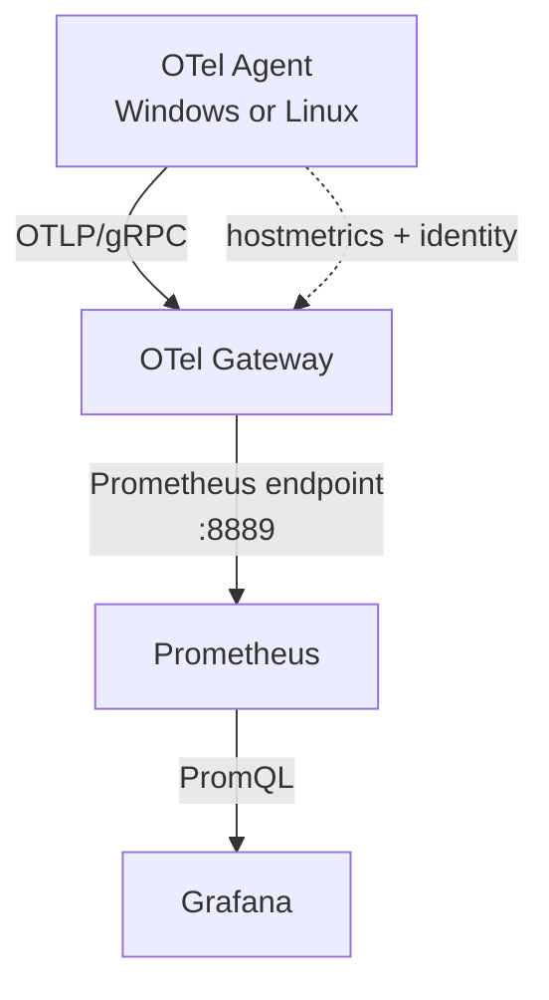

# Metrics Spine

## Purpose

The first observability data path collects host metrics from Windows and Linux
nodes and makes them queryable through Prometheus and Grafana.

## Components

| Component    | Responsibility                                                    |
| ------------ | ----------------------------------------------------------------- |
| Node Agent   | Collect host metrics, attach node identity, and export OTLP/gRPC. |
| OTel Gateway | Receive OTLP metrics and expose them in Prometheus format.        |
| Prometheus   | Scrape, retain, and query metrics from the Gateway.               |
| Grafana      | Provide the PromQL query and visualization interface.             |

## Identity contract

Every metric emitted by the Agent carries these resource attributes:

| Attribute                | Meaning                                                      |
| ------------------------ | ------------------------------------------------------------ |
| `host.name`              | Current human-readable hostname.                             |
| `host.id`                | Stable OS-derived, hashed machine identifier with OS prefix. |
| `service.name`           | `ar-imms-node-agent`.                                        |
| `asset.type`             | Profile-owned classification, currently `laptop`.            |
| `deployment.environment` | Profile-owned environment, currently `homelab`.              |

The Gateway Prometheus exporter converts these attributes to labels such as
`host_id`, `host_name`, and `service_name`.

## Port contract

| Context                              | Address           | Purpose                                                   |
| ------------------------------------ | ----------------- | --------------------------------------------------------- |
| Agent local OTLP/gRPC receiver       | `127.0.0.1:4317`  | Local applications send OTLP to the Agent.                |
| Agent local health endpoint          | `127.0.0.1:13133` | Supervisor readiness and local health checks.             |
| Gateway container OTLP/gRPC receiver | `:4317`           | Gateway ingress inside Docker.                            |
| Gateway Prometheus exporter          | `:8889`           | Docker-internal Prometheus scrape endpoint.               |
| Gateway health endpoint              | `127.0.0.1:13134` | Local operational health check in all-in-one development. |
| Grafana                              | `127.0.0.1:13000` | Local Grafana UI.                                         |

For the all-in-one Windows development setup, Docker maps host port `14317` to
Gateway container port `4317`. This prevents collision with the Agent's local
receiver on host port `4317`.

For the intended multi-node deployment, the Gateway runs on a separate Ubuntu
host and Agents export to `<gateway-lan-ip>:4317`.

## Current scope

Included:

- Cross-platform host metrics: CPU, memory, disk, filesystem, network, paging.
- Agent-to-Gateway OTLP/gRPC metrics delivery.
- Gateway-to-Prometheus pull-based collection.
- Grafana Prometheus datasource provisioning.

Not included:

- TLS, mTLS, node registration, or certificate rotation.
- Loki, Tempo, alerts, dashboards, or analytics fan-out.
- Windows exporter and LibreHardwareMonitor installation.
- High availability, durable queueing, or remote storage.
