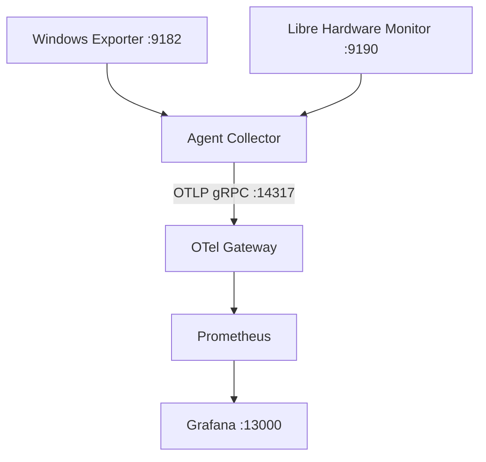

# Metrics Spine

The Windows proof of concept sends hardware and operating-system telemetry through the local Agent and central Gateway.



## Endpoint roles

| Endpoint                    | Role                            |
| --------------------------- | ------------------------------- |
| `127.0.0.1:9182`            | Windows Exporter metrics        |
| `127.0.0.1:9190`            | Libre Hardware Monitor metrics  |
| `127.0.0.1:13133`           | Agent Collector health          |
| `127.0.0.1:13134/v1/status` | Agent lifecycle status API      |
| `127.0.0.1:14317`           | Central Gateway OTLP gRPC       |
| `127.0.0.1:14133`           | Gateway health in the local PoC |
| `127.0.0.1:13000`           | Grafana                         |

`127.0.0.1:4317` is the local Agent Collector receiver. It must not be configured as the central Gateway endpoint because that creates a local loop.

## Grafana verification

Windows operating-system telemetry:

```promql
windows_os_info
```

Libre Hardware Monitor temperatures:

```promql
{__name__=~"lhm_.*_temperature_celsius"}
```

LHM metric labels identify sensors without the Node Exporter `hwmon` join:

```text
hardwareName
hardwareId
sensorName
sensorId
host
```

## Disable semantics

Disabling a dependency stops new samples. Prometheus keeps samples already ingested, so historical charts remain visible until their time range ends.

An instant PromQL query can still return the last sample during Prometheus lookback. Confirm it is stale with:

```promql
time() - timestamp(<metric>)
```

The value must increase after disable. Grafana panels should use `Connect null values = Never` so a line ends at the final sample.

## Current Agent health limitation

The Agent status API is authoritative:

```powershell
Invoke-RestMethod 'http://127.0.0.1:13134/v1/status'
```

The current Metrics Spine does not yet export a dedicated Agent heartbeat metric. Therefore LHM or Windows Exporter metrics must not be used as Agent health: dependencies can be disabled while the Agent remains healthy.
