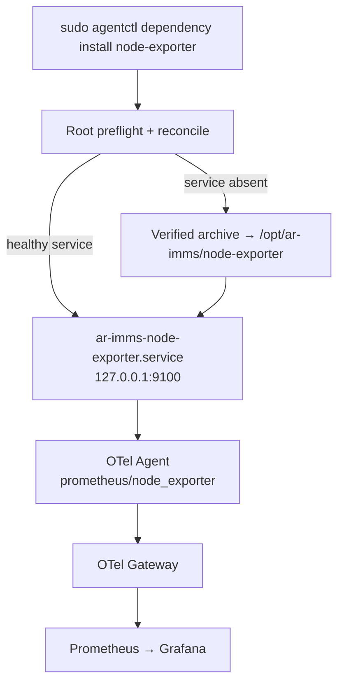

# Node Exporter managed dependency

`node-exporter` là Linux-only dependency do `agentctl` quản lý. Nó bổ sung metric
`node_*`; không thay thế `hostmetrics` baseline của OTel Agent.

# Ownership and safety
| Resource         | Owner                                               |
| ---------------- | --------------------------------------------------- |
| Binary           | `/opt/ar-imms/node-exporter/node_exporter`          |
| systemd unit     | `/etc/systemd/system/ar-imms-node-exporter.service` |
| Metrics endpoint | `127.0.0.1:9100/metrics`                            |
| Artifact         | pinned Node Exporter `v1.12.1`, SHA-256 verified    |

Reconciliation policy:
| State                                 | Action                                         |
| ------------------------------------- | ---------------------------------------------- |
| Unit absent                           | Download, verify, install, start, health-check |
| Unit exists and `/metrics` is healthy | Reuse                                          |
| Unit exists but unhealthy             | Fail without overwrite                         |

The default Linux `hostmetrics` profile does not enable the `process`` scraper.
Per-process `/proc` access requires elevated runtime privileges and is deferred to an explicit future capability.
