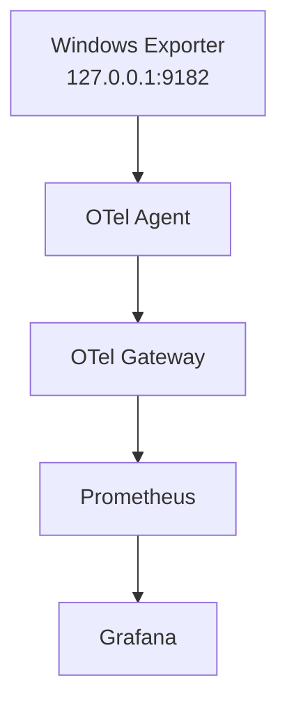

# Windows Exporter Managed Dependency

**Status: implemented**
**Scope: Windows amd64, windows_exporter v0.31.8**

## Purpose

- Windows Exporter provides Windows-specific metrics via a local Prometheus endpoint.
- OTel Agent is the sole component that scrapes this endpoint and sends telemetry to the gateway.

## Ownership

| Component                                      | Responsibility                                                                       |
| ---------------------------------------------- | ------------------------------------------------------------------------------------ |
| `agentctl dependency install windows-exporter` | Installs and reconciles the dependency                                               |
| MSI                                            | Installs and manages the `windows-exporter` Windows Service                          |
| Agent                                          | Owns the configuration file at `C:\ProgramData\AR-IMMS\windows-exporter\config.yaml` |
| OTel Agent                                     | Scrapes `127.0.0.1:9182`, attaches host identity, and exports to the gateway         |
| Prometheus                                     | Scrapes metrics exposed by the gateway; does not access the node exporter directly   |

---

## Safety Policy

- Installation strictly requires an Administrator terminal.
- The MSI version and SHA-256 hash are pinned before execution.
- The exporter binds exclusively to `127.0.0.1:9182`.
- Existing healthy services are reused.
- Non-existent services are newly installed.
- Existing but unhealthy services will fail and will not be automatically overwritten or repaired.

## Agent Configuration Contract

The Windows metrics pipeline consists of three receivers:

- `otlp`
- `hostmetrics`
- `prometheus/windows_exporter`

Metrics pass through the Agent's resource processors, preserving `host_id`, `host_name`, `asset.type`, and `deployment.environment`.

## Out of Scope

LibreHardwareMonitor, Node Exporter, dependency upgrade/repair/uninstall, automatic UAC elevation, and the Windows Service for the OTel Agent itself are not included in this checkpoint.
