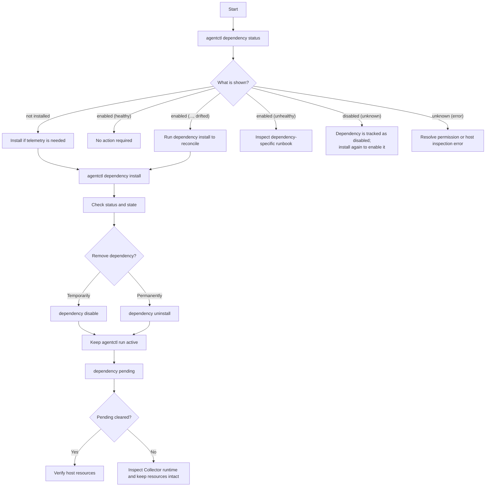

# Managed Dependencies Runbook

## Purpose

Use this runbook to install, inspect, disable, or uninstall telemetry
dependencies managed by `agentctl`.

Run machine-wide Windows operations from an Administrator terminal.

## Operating Flow



## Prerequisites

- Bootstrap the Collector before managing dependencies.
- Keep `agentctl run` active while waiting for disable or uninstall teardown.
- Use the same `--state-path` for related commands when a custom state path is
  used.
- Do not manually remove Agent-managed services, tasks, firewall rules, or
  configuration files while a teardown is pending.

## List Supported Dependencies

```powershell
agentctl dependency list
```

The result is filtered for the local operating system.

## Inspect Status

```powershell
agentctl dependency status
```

With a custom state path:

```powershell
agentctl dependency status --state-path C:\ProgramData\AR-IMMS\agent\state.json
```

| Result                       | Meaning                                                                         | Operator action                                              |
| ---------------------------- | ------------------------------------------------------------------------------- | ------------------------------------------------------------ |
| `not installed`              | The dependency is not recorded in Agent state and is not active on the host.    | Install it if required.                                      |
| `enabled (healthy)`          | The dependency is active and its managed configuration matches.                 | No action required.                                          |
| `enabled (healthy, drifted)` | The dependency is healthy, but managed configuration differs.                   | Run `dependency install <name>` to reconcile.                |
| `enabled (unhealthy)`        | The dependency is enabled but not healthy.                                      | Inspect the dependency-specific runbook.                     |
| `disabled (unknown)`         | The dependency is recorded as disabled; no running health endpoint is expected. | Run install to enable it again, or uninstall it permanently. |
| `unknown (...)`              | Host inspection could not complete.                                             | Resolve the reported permission, platform, or system error.  |

## Install or Reconcile

Install one dependency:

```powershell
agentctl dependency install windows-exporter
```

Select supported dependencies interactively:

```powershell
agentctl dependency install
```

After installation, verify:

```powershell
agentctl dependency status
```

A fresh Agent installation records ownership of the resources it creates.

## Disable

Disable stops or disables the dependency after the Collector has successfully
applied a configuration without that dependency receiver.

```powershell
agentctl dependency disable libre-hardware-monitor
```

Then monitor progress:

```powershell
agentctl dependency pending
```

Keep `agentctl run` active. The pending entry clears only after the Collector
is ready for the matching configuration generation.

Disable preserves the installation so it can be enabled again later.

## Uninstall

Uninstall removes Agent-owned host resources only after the Collector is ready
without that dependency receiver.

```powershell
agentctl dependency uninstall windows-exporter
```

Monitor progress:

```powershell
agentctl dependency pending
```

When no entry remains, verify the dependency-specific service, task, firewall
rule, configuration, or installation directory as appropriate.

## Pending Teardowns

```powershell
agentctl dependency pending
```

Example:

```text
Pending dependency teardowns:
- windows-exporter: uninstall, generation 4 (applied generation: 3)
```

This means the Collector has not yet confirmed generation `4`; no physical
cleanup should be expected yet.

If a pending entry does not clear:

1. Confirm `agentctl run` is still running.
2. Check the Collector runtime output and health endpoint.
3. Check that `AppliedGeneration` can reach the pending generation in the
   state file.
4. Do not manually delete the resource while the teardown remains pending.

## Ownership Rules

The Agent removes only resources recorded in persistent ownership state.

- Fresh installations are eligible for automatic disable or uninstall.
- Existing installations discovered during reconciliation are not
  automatically adopted.
- A dependency without recorded ownership can still be removed from Collector
  configuration, but its physical host resources are preserved.

This prevents the Agent from deleting a manually installed or third-party
dependency.

## Dependency-Specific Runbooks

- [Windows Exporter](windows_exporter.md)
- [Node Exporter](node-exporter.md)
- [Libre Hardware Monitor](libre-hardware-monitor.md)
