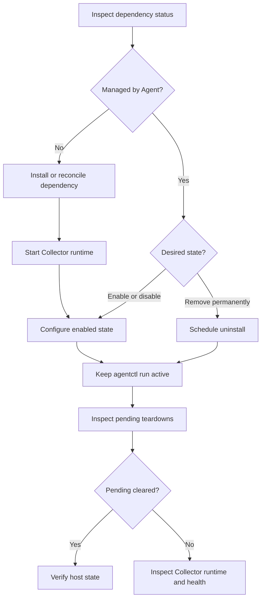

# Managed Dependencies Runbook

## Purpose

Use this runbook to install, inspect, configure, disable, or uninstall telemetry
dependencies managed by `agentctl`.

Run machine-wide Windows operations from an Administrator terminal.

## Operating Flow



## Prerequisites

- Bootstrap the Collector before managing dependencies.
- Keep `agentctl run` active while waiting for disable or uninstall teardown.
- Use the same `--state-path` for related commands when a custom state path is
  used.
- Do not manually remove Agent-managed services, tasks, firewall rules, or
  configuration files while a teardown is pending.

## Inspect Status

```powershell
agentctl dependency status
agentctl dependency pending
```

Use the custom state path consistently when applicable:

```powershell
agentctl dependency status --state-path C:\ProgramData\AR-IMMS\agent\state.json
```

## Install or Reconcile

Install one dependency:

```powershell
agentctl dependency install windows-exporter
```

Select supported dependencies interactively:

```powershell
agentctl dependency install
```

A fresh Agent installation records ownership of the resources it creates.

## Configure Enabled State

Use the interactive selector to enable or disable dependencies already recorded
in Agent state:

```powershell
agentctl dependency configure
```

With a custom state path:

```powershell
agentctl dependency configure --state-path C:\ProgramData\AR-IMMS\agent\state.json
```

Controls:

| Key                  | Action                         |
| -------------------- | ------------------------------ |
| `Space`              | Toggle the selected dependency |
| `Enter`              | Apply changed states           |
| `q`, `Esc`, `Ctrl+C` | Cancel without changes         |

`●` means enabled and `○` means disabled.

The selector does not install new dependencies. Use `dependency install` first.
Enabling requires recorded Agent ownership; the Agent refuses to enable a
disabled dependency that it does not own.

After applying changes, check:

```powershell
agentctl dependency status
agentctl dependency pending
```

## Disable

Disable removes the dependency receiver from Collector configuration, then
disables the Agent-owned host resource after the Collector acknowledges that
configuration generation.

```powershell
agentctl dependency disable libre-hardware-monitor
```

For an interactive toggle, use `dependency configure` instead.

Disable preserves the installation and ownership so the dependency can later be
enabled again.

## Uninstall

Uninstall removes Agent-owned host resources only after the Collector is ready
without that dependency receiver.

```powershell
agentctl dependency uninstall windows-exporter
```

An uninstalled dependency no longer appears in `dependency configure`. Install
it again to create a new managed record.

## Pending Teardowns

```powershell
agentctl dependency pending
```

Example:

```text
Pending dependency teardowns:
- windows-exporter: uninstall, generation 4 (applied generation: 3)
```

This means the Collector has not yet confirmed generation `4`; no physical
cleanup should be expected yet.

If a pending entry does not clear:

1. Confirm `agentctl run` is still running.
2. Check the Collector runtime output and health endpoint.
3. Check that `AppliedGeneration` can reach the pending generation in the
   state file.
4. Do not manually delete the resource while the teardown remains pending.

## Ownership Rules

The Agent removes only resources recorded in persistent ownership state.

- Fresh installations are eligible for automatic disable or uninstall.
- Existing installations discovered during reconciliation are not automatically
  adopted.
- A dependency without recorded ownership can be removed from Collector
  configuration, but its physical host resources are preserved.

## Dependency-Specific Runbooks

- [Windows Exporter](windows_exporter.md)
- [Node Exporter](node-exporter.md)
- [Libre Hardware Monitor](libre-hardware-monitor.md)

## Foundation Checks

```bash
go test ./... -count=1
go vet ./...
go build ./...
git diff --check
```
