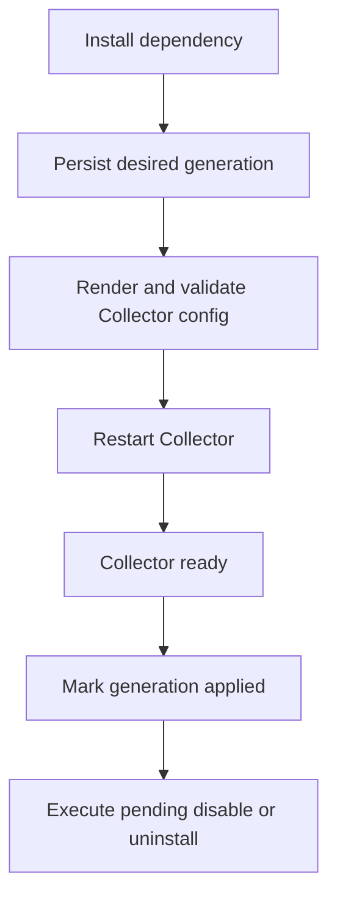

# Windows Agent E2E Lifecycle

This runbook verifies a clean Windows installation, managed dependencies, Gateway delivery, and clean uninstall.

## Prerequisites

- Run PowerShell as Administrator.
- Gateway OTLP is reachable at `127.0.0.1:14317`.
- Grafana is reachable at `http://127.0.0.1:13000`.
- Build the external binary used for installation and clean uninstall.

```powershell
go test ./...
go build -o .\.e2e\bin\agentctl.exe ./cmd/agentctl
Test-NetConnection 127.0.0.1 -Port 14317
```

## Install

```powershell
.\.e2e\bin\agentctl.exe install `
  --config-root (Join-Path $PWD 'configs') `
  --gateway-endpoint '127.0.0.1:14317'
```

Verify Agent state:

```powershell
Invoke-RestMethod 'http://127.0.0.1:13134/v1/status'
```

Expected:

```text
status: healthy
collectorState: ready
desiredGeneration = activatedGeneration = appliedGeneration
pendingTeardowns: 0
```

## Install managed dependencies

```powershell
& 'C:\Program Files\AR-IMMS\Telemetry Agent\agentctl.exe' dependency install
```

Select Windows Exporter and Libre Hardware Monitor.

```powershell
Get-Service ar-imms-telemetry-agent, windows_exporter
Get-Process LibreHardwareMonitor -ErrorAction SilentlyContinue
Invoke-WebRequest http://127.0.0.1:9182/metrics -UseBasicParsing
```

Check Grafana with `windows_os_info` and:

```promql
{__name__=~"lhm_.*_temperature_celsius"}
```

## Disable and enable

```powershell
& 'C:\Program Files\AR-IMMS\Telemetry Agent\agentctl.exe' dependency disable windows-exporter
& 'C:\Program Files\AR-IMMS\Telemetry Agent\agentctl.exe' dependency disable libre-hardware-monitor
```

After the next Collector generation is applied, both dependency processes must stop while the Agent remains running.

Use `dependency configure` to enable dependencies again.



## Uninstall dependencies

```powershell
& 'C:\Program Files\AR-IMMS\Telemetry Agent\agentctl.exe' dependency uninstall libre-hardware-monitor
& 'C:\Program Files\AR-IMMS\Telemetry Agent\agentctl.exe' dependency uninstall windows-exporter
```

Verify that the Agent remains healthy, but no dependency remains:

```powershell
Get-Service windows_exporter -ErrorAction SilentlyContinue
Get-Process LibreHardwareMonitor -ErrorAction SilentlyContinue
Get-ScheduledTask -TaskName 'AR-IMMS-LibreHardwareMonitor' -ErrorAction SilentlyContinue
```

## Clean uninstall Agent

Clean uninstall must use an external binary because the installed binary is removed.

```powershell
.\.e2e\bin\agentctl.exe uninstall
```

Verify cleanup:

```powershell
Get-Service ar-imms-telemetry-agent, windows_exporter -ErrorAction SilentlyContinue
Get-Process LibreHardwareMonitor -ErrorAction SilentlyContinue
Get-ScheduledTask -TaskName 'AR-IMMS-LibreHardwareMonitor' -ErrorAction SilentlyContinue
Test-Path 'C:\Program Files\AR-IMMS\Telemetry Agent'
Test-Path 'C:\ProgramData\AR-IMMS\Telemetry Agent'
```

Expected: no services, no LHM process or task, and both paths return `False`.
