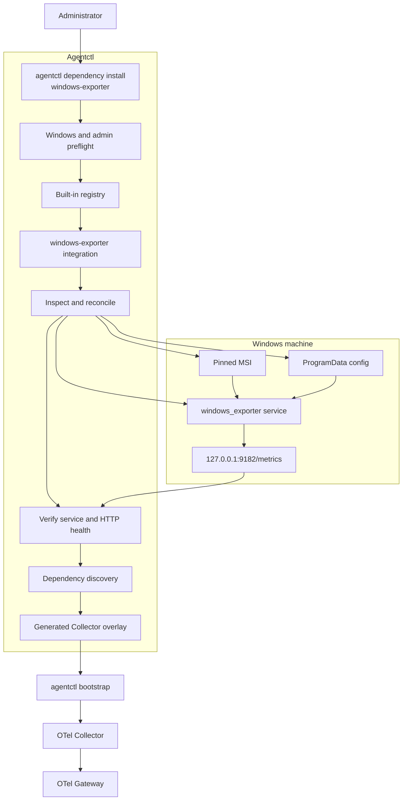

# Windows Exporter Dependency Integration Design

## Status

Proposed

## Goal

Enable an Administrator to install and operate Windows exporter through the
Telemetry Agent while keeping the Agent-to-Gateway telemetry contract unchanged.

The first command is:

```text
agentctl dependency install windows-exporter
```

The command must be idempotent, verify its dependency before use, and avoid
exposing the exporter directly to the LAN.

## Scope

Included:

- A built-in dependency registry.
- A Windows-only Windows exporter integration.
- Administrator preflight.
- Pinned MSI download and SHA-256 verification.
- Silent MSI installation, service configuration, service start, and repair.
- Exporter configuration owned under `C:\ProgramData\AR-IMMS\`.
- Loopback-only Prometheus endpoint at `127.0.0.1:9182`.
- Bounded `/metrics` health verification.
- Conditional activation of the Collector Prometheus receiver through a
  generated integration overlay.
- Dependency status inspection.

Excluded:

- LibreHardwareMonitor.
- Node exporter.
- Automatic UAC elevation.
- Dependency profiles.
- Uninstall command.
- Go Agent Windows Service registration.
- TLS, mTLS, node registration, durable queues, and remote configuration.

## Architecture



## Ownership boundaries

| Boundary                                    | Owner                   | Rule                                                                        |
| ------------------------------------------- | ----------------------- | --------------------------------------------------------------------------- |
| Base/profile/OS config in repository        | Repository              | Portable baseline only; it must not assume Windows exporter exists.         |
| Windows exporter binary and Windows Service | MSI installer / Windows | Inspected by Agent; not replaced by custom `sc.exe` service creation.       |
| Exporter configuration                      | Agent                   | Stored under `C:\ProgramData\AR-IMMS\windows-exporter\`.                    |
| Exporter endpoint                           | Windows exporter        | Binds only `127.0.0.1:9182`.                                                |
| Final Collector configuration               | Bootstrap               | Includes exporter scrape receiver only after verified dependency discovery. |
| Telemetry egress                            | OTel Agent              | Only the Agent sends OTLP to the Gateway.                                   |

The central Prometheus server must not scrape individual Windows exporters.

## Dependency contract

Each built-in dependency exposes a small lifecycle contract:

```text
name
supported platforms
inspect current system state
install or repair a pinned version
configure Agent-owned local state
start or verify runtime state
perform health check
contribute an optional Collector integration overlay
report status
```

The registry is compiled into `agentctl`. No remote plugin manifests, shell
scripts, or dynamically downloaded dependency definitions are in scope.

The first registry entry is `windows-exporter`. Future entries may include
`libre-hardware-monitor`, `node-exporter`, or Docker-related integrations
without changing the CLI command shape.

## Windows exporter install contract

The integration uses the official pinned MSI because it creates and manages
the upstream Windows Service.

The Agent must:

1. Verify it is running on Windows with an Administrator token.
2. Download the pinned MSI into a private staging directory.
3. Verify the MSI SHA-256 against the compiled artifact manifest.
4. Write the Agent-owned exporter configuration before installation.
5. Run the MSI silently with the required configuration reference.
6. Confirm the expected Windows Service exists and is running.
7. Poll `http://127.0.0.1:9182/metrics` with a bounded timeout.
8. Report installed version, service state, endpoint, and whether the state
   was reused, repaired, or upgraded.

The installer must not add a LAN-wide firewall exception. A port already held
by a different process is a failure; the Agent must not terminate or replace
that process.

## Reconciliation rules

| Observed state                                         | Required behavior                                            |
| ------------------------------------------------------ | ------------------------------------------------------------ |
| Correct version, owned config matches, service healthy | Reuse and report healthy.                                    |
| Correct version, service stopped                       | Start service, then health-check.                            |
| Correct version, config differs                        | Repair configuration and restart service.                    |
| Different installed version                            | Install the pinned version and verify the resulting service. |
| Service missing                                        | Install the pinned MSI.                                      |
| Port `9182` held by another process                    | Fail with diagnostics; do not take ownership.                |
| MSI checksum mismatch                                  | Fail before installation.                                    |
| Missing Administrator token                            | Fail before downloading or changing machine state.           |
| Service starts but `/metrics` remains unhealthy        | Fail and do not activate the Collector overlay.              |

The observed Windows Service, binary version, owned-config hash, bound
endpoint, and health result are the source of truth. Installation metadata is
only an optimization and must not override system inspection.

## Collector integration activation

The repository Windows layer remains a hostmetrics-only baseline.

When bootstrap runs, it discovers verified dependencies. A verified
`windows-exporter` contributes a generated configuration overlay equivalent to:

```yaml
receivers:
  prometheus/windows_exporter:
    config:
      scrape_configs:
        - job_name: windows_exporter
          scrape_interval: 15s
          static_configs:
            - targets:
                - 127.0.0.1:9182

service:
  pipelines:
    metrics:
      receivers:
        - otlp
        - hostmetrics
        - prometheus/windows_exporter
```

The overlay is generated by Agent code during rendering and incorporated into
the final validated `otel.yaml`; it does not mutate repository config files.

If Windows exporter is absent or unhealthy, bootstrap renders the baseline
without this receiver. This prevents failed scrape warnings on an unprovisioned
machine.

## Operator workflow

For Phase 2C.1:

```text
1. Open an Administrator terminal.
2. Run: agentctl dependency install windows-exporter
3. Run: agentctl bootstrap ...
4. Run: agentctl run ...
```

A future `agentctl provision --profile windows-baseline` may orchestrate these
steps after at least two dependencies exist. It is intentionally not part of
this slice.

## Security and operational constraints

- Pin exact artifact version and SHA-256 in code.
- Do not use `latest` artifacts.
- Keep the exporter endpoint on loopback.
- Do not self-elevate through UAC.
- Do not store secrets in the dependency state.
- Do not treat WMI/Service presence alone as health.
- Do not enable the Collector receiver until `/metrics` is healthy.
- Keep Agent logs actionable: include dependency name, version, service state,
  endpoint, and remediation reason; never dump unbounded installer output.

## Testing strategy

Unit tests must cover:

- Registry lookup and unsupported platform rejection.
- Administrator preflight failure.
- Artifact selection and checksum mismatch.
- Reconciliation of each state in the table above.
- Port collision behavior.
- Service start and health timeout behavior.
- Successful reuse without reinstall.
- Generated overlay inclusion only for a verified healthy dependency.
- Bootstrap rendering without the overlay when the dependency is absent.

Windows end-to-end verification must prove:

1. `agentctl dependency install windows-exporter` succeeds from an
   Administrator terminal.
2. The upstream service is running and serves `/metrics` on loopback.
3. Bootstrap renders and validates the conditional Prometheus receiver.
4. The Agent starts without scrape warnings.
5. Windows exporter metrics arrive at Gateway, Prometheus, and Grafana with
   the existing `host.id` resource identity.

## Consequences

This design adds a small dependency-management boundary to the Agent, but
avoids configuration drift and prevents unhealthy external integrations from
breaking the baseline Agent.

It gives engineers one explicit administrative command today and a stable
foundation for a future Windows baseline profile containing Windows exporter
and LibreHardwareMonitor.
